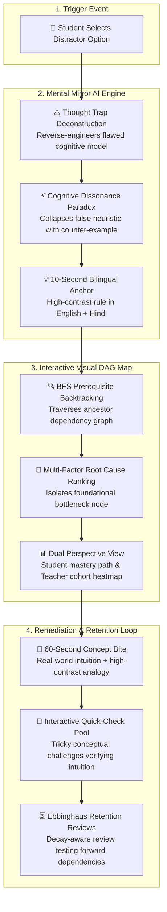
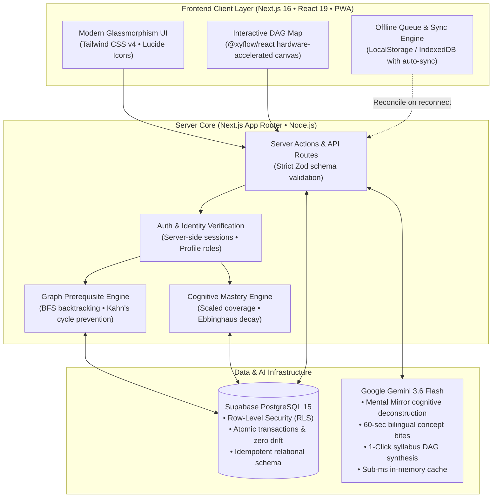

# LearnPulse 🧠⚡
### Autonomous Learning Continuity, Remediation & Cognitive Misconception Engine
> **Smart India Hackathon (SIH 2026) — Problem Statement: SIH 26207**  
> *"Know what you don't know — and why you chose what you chose."*

[-black?logo=next.js)](https://nextjs.org/)
[](https://www.typescriptlang.org/)
[](https://supabase.com/)
[](https://ai.google.dev/)
[](https://tailwindcss.com/)
[-brightgreen?logo=vitest)](https://vitest.dev/)
[](https://eslint.org/)
[](#-security-privacy--acid-integrity)

---

## 📑 Table of Contents
1. [Executive Summary & Novelty](#-executive-summary--novelty)
2. [Key Innovations & Features](#-key-innovations--features)
3. [System Architecture](#-system-architecture)
4. [Mathematical Formulations & Algorithms](#-mathematical-formulations--algorithms)
5. [Technology Stack](#-technology-stack)
6. [Quick Start & Installation](#-quick-start--installation)
7. [Demo Accounts for Evaluators](#-demo-accounts-for-evaluators)
8. [API Reference & Route Specifications](#-api-reference--route-specifications)
9. [Automated Testing & Quality Assurance](#-automated-testing--quality-assurance)
10. [Security, Privacy & ACID Integrity](#-security-privacy--acid-integrity)
11. [Project Directory Structure](#-project-directory-structure)
12. [License & Acknowledgments](#-license--acknowledgments)

---

## 🌟 Executive Summary & Novelty

Traditional learning platforms and computerized quizzes treat learning as a flat checklist:
* **Generic Explanations:** When a student chooses a wrong option, traditional tools output textbook summaries describing why the correct answer is right—ignoring *why* the student was tempted by the distractor.
* **Repetitive Grinding:** Students are forced through redundant loops to artificially raise percentages, causing high-performing learners to disengage and struggling students to memorize answers.
* **Isolated Failures:** Prerequisite dependencies are overlooked; a failure in *Query Optimization* is treated as an isolated gap rather than a failure in *B-Tree Indexing* or *Disk I/O Models*.

**LearnPulse** transforms educational diagnostics with a **graph-native prerequisite architecture + cognitive reverse-engineering engine**:



---

## 🚀 Key Innovations & Features

### 1. Interactive Visual DAG Knowledge Graph (`@xyflow/react`)
* **Interactive Canvas:** Pan, zoom, node selection, depth-ranked topological tiers, and real-time color-coded mastery status (Mastered, Developing, At-Risk, Bottleneck).
* **Dual-Perspective Rendering:**
  * **Student Mode:** Shows personalized mastery score, prerequisite dependency breadcrumbs, and instant remediation triggers.
  * **Teacher Mode:** Automatically aggregates class-wide cohort averages, highlighting systemic bottlenecks across entire batches.

### 2. "Mental Mirror" AI Cognitive Misconception Engine
* **Deconstructive Feedback:** Rather than lecturing on the right answer, it explains the **Thought Trap** that lured the student into the chosen option.
* **Cognitive Dissonance:** Supplies a concrete paradox scenario forcing the flawed heuristic to collapse in under 30 seconds.
* **NEP 2020 Bilingual Reinforcement:** Delivers full dual-language support in English and Hindi/Hinglish for native conceptual retention.
* **Sub-Millisecond In-Memory Caching:** Identical wrong choices resolve in `<1ms` without redundant LLM queries or token spend.

### 3. 60-Second Remediation Bites
* Renders directly above practice sessions when bottleneck concepts are detected.
* Delivers:
  * **The Core Intuition:** 2 sentences establishing real-world justification.
  * **High-Contrast Analogy:** Real-world comparison (e.g., library card catalog vs. scanning every shelf).
  * **10-Second Dual-Language Anchor:** Compact heuristic formula.
  * **Conceptual Quick-Check:** Randomized, tricky conceptual challenge pool to verify intuition before re-entering MCQ quizzes.

### 4. Ebbinghaus Forgetting Curve & Decay-Aware Review
* Models retention decay over time: $R = e^{-t / S}$.
* Concepts with high decay flags (`isDue = true`) trigger targeted review questions drawn from **forward dependent concepts**, verifying practical retention rather than simple recall.

### 5. Teacher 1-Click AI Syllabus Ingestion & Cycle Prevention
* Ingests free-form course outlines, syllabi, or textbook chapters.
* Gemini synthesizes atomic concepts, dependency edges, and diagnostic questions in seconds.
* **Zero-Cycle Guarantee:** Integrates Kahn's topological sorting algorithm on the server to mathematically reject any cyclic dependency before committing to Postgres.

### 6. Offline Resilience & Auto-Sync
* Local storage queue records attempts and timestamped responses when internet connectivity drops.
* Seamless background reconciliation automatically updates mastery upon reconnection with zero duplicate attempts.

### 7. Student Course Discovery & Self-Enrollment (Freedom of Choice)
* **Course Catalog (`/dashboard/courses`):** Dedicated discovery hub allowing students to explore all available courses with live search, subject filters, and concept count tags.
* **1-Click Self-Enrollment & Drops:** Complete student autonomy to join or leave courses. Diagnostic tracking, attempts, and mastery are isolated strictly to enrolled courses.
* **Cohort Roster Isolation:** Teacher dashboard metrics, student counts, and class-wide bottleneck heatmaps automatically filter to students who are actively enrolled in that specific course.

---

## 🏛️ System Architecture



---

## 📐 Mathematical Formulations & Algorithms

### 1. Question-Bank-Aware Scaled Mastery
Prevents grinding while ensuring high standards:
$$\text{Coverage} = \min\left(1, \frac{\text{Unique Questions Solved Correctly}}{\text{Total Available Questions for Concept}}\right)$$

$$\text{Accuracy} = \frac{\text{Total Correct Attempts}}{\text{Total Attempts}}$$

$$\text{Mastery Score} = \text{round}\Big(\text{Coverage} \times (80 + 20 \times \text{Accuracy})\Big)$$

| Score Range | Mastery Level | Educational Stage |
| :---: | :---: | :--- |
| **0 – 39%** | **Level 1 • Getting Started** | Initial exposure; prerequisite check recommended |
| **40 – 69%** | **Level 2 • Developing** | Partial bank completion or mixed consistency |
| **70 – 84%** | **Level 3 • Proficient** | Majority of questions solved with high accuracy |
| **85 – 100%** | **Level 4 • Mastered 🏆** | Full bank mastery with high precision |

### 2. Root Cause Candidate Ranking Heuristic
When a student struggles, prerequisite candidates are ranked to pinpoint the foundational blocker:
$$\text{Score} = 0.45 \cdot \text{Weakness} + 0.25 \cdot \text{EdgeWeight} + 0.20 \cdot \text{Evidence} + 0.10 \cdot \text{Recency}$$

* **Weakness:** Inverse of current mastery ($1 - \frac{\text{Mastery}}{100}$).
* **EdgeWeight:** Normalized dependency coupling factor ($w \in [0.1, 1.0]$).
* **Evidence:** Ratio of failed attempts on the prerequisite concept.
* **Recency:** Proximity of last practice activity.

### 3. Ebbinghaus Forgetting Curve Retention
$$R(t) = e^{-\frac{t}{S}}$$
Where:
* $t$ is elapsed days since last practice.
* $S$ is memory stability determined by mastery level ($S = \text{Mastery} \times 0.14$).
* If $R(t) < 0.60$, the concept is marked as `isDue = true`, prompting retention review.

---

## 🛠️ Technology Stack

| Layer | Framework / Tool | Version | Purpose |
| :--- | :--- | :--- | :--- |
| **Fullstack Framework** | **Next.js** | `16.3.4` (Turbopack) | Server Components, Streaming SSR, API Routes, Edge Routing |
| **Runtime & Core** | **Node.js** / **TypeScript** | `v20+` / `5.x Strict` | Strict type safety, 0 runtime type errors |
| **Database & Auth** | **Supabase** (PostgreSQL 15) | Latest | Relational schema, ACID compliance, Row-Level Security (RLS) |
| **AI Diagnosis & Synthesis** | **Google Gemini** | `3.6 Flash` | Sub-second cognitive analysis, bilingual synthesis, structured JSON |
| **Graph Visualization** | **@xyflow/react** | `12.4.x` | Hardware-accelerated interactive canvas DAG graph |
| **Schema Validation** | **Zod** | `3.24.x` | Strict input bounds, payload sanitization, AI schema validation |
| **Styling & Design System** | **Tailwind CSS + Vanilla CSS** | `v4.x` | Modern glassmorphism, responsive themes, accessible color palette |
| **Unit & Integration Tests** | **Vitest** | `5.0.x` | 101 automated unit, algorithm, and simulation tests |

---

## ⚡ Quick Start & Installation

### 1. Prerequisites
* **Node.js**: `v20.x` or higher (tested on Node v22)
* **npm**: `v10.x` or higher
* A free **Supabase** project ([supabase.com](https://supabase.com))
* A free **Google Gemini API Key** ([aistudio.google.com](https://aistudio.google.com/app/apikey))

### 2. Clone & Install Dependencies
```bash
git clone https://github.com/your-username/learnpulse.git
cd learnpulse/learnpulse-app
npm install
```

### 3. Configure Environment Variables
Create your local environment configuration:
```bash
cp .env.local.example .env.local
```

Populate the required credentials in `.env.local`:
```env
# Supabase Project URL & Anon Public Key (Found in Supabase Settings -> API)
NEXT_PUBLIC_SUPABASE_URL=https://your-project-id.supabase.co
NEXT_PUBLIC_SUPABASE_ANON_KEY=your-anon-public-key

# Supabase Service Role Key (Used for server-side administrative tasks)
SUPABASE_SERVICE_ROLE_KEY=your-service-role-key

# Google Gemini API Key (Found in Google AI Studio)
GEMINI_API_KEY=your-gemini-api-key
```

### 4. Database Setup & Migrations
1. Open your Supabase Dashboard -> **SQL Editor** -> **New Query**.
2. Run the migration script located at `supabase/schema.sql` to create all tables, indexes, triggers, and Row-Level Security policies.
3. *(Optional)* Run `supabase/fix_rls.sql` if you need to refresh policies.

### 5. Idempotent Data Reset & Cohort Baseline
Initialize the database with a clean 0% baseline, official demo accounts, and synchronized student profiles:
```bash
node --env-file=.env.local scripts/reset_demo_data.mjs
```

### 6. Launch Development Server
```bash
npm run dev
```
Navigate to [http://localhost:3000](http://localhost:3000) in your browser.

---

## 👥 Demo Accounts for Evaluators

All demo accounts feature simple, memorable credentials. The workspace starts with a clean **0% baseline** across all courses with full ACID transactional integrity:

| Role | Email | Password | Persona & Pedagogical State |
| :--- | :--- | :--- | :--- |
| **Teacher (Prof Sandip Ghosal)** | `sandip@gmail.com` | `sandip123` | Course author, cohort analytics, class-wide bottleneck visualizer |
| **Student (Rebortak Roy)** | `rebortak@gmail.com` | `rebortak123` | CS undergraduate cohort member exploring core subjects |
| **Student (Arnab Roy)** | `arnab@gmail.com` | `arnab123` | CS undergraduate cohort member engaging with diagnostic practice |
| **Student (Megha De)** | `megha@gmail.com` | `megha123` | CS undergraduate cohort member testing knowledge graph mastery |

### Database Reset & Clean Sync Command
To reset the platform to a clean 0% mastery baseline and synchronize student profiles at any time:
```bash
node --env-file=.env.local scripts/reset_demo_data.mjs
```

---

## 🔌 API Reference & Route Specifications

### `POST /api/diagnose`
Analyzes a student's gap on a target concept and executes root-cause backtracking.
* **Payload:** `{ targetConceptId: UUID, targetConceptName: string, targetMastery: number, prerequisites: Array }`
* **Response:** `{ rootCause: string, blockingConceptId: UUID, confidence: number, explanation: string, actionPlan: Array }`

### `POST /api/submit-attempt`
Submits an MCQ answer, updates the student attempt history, calculates scaled mastery, and detects retention decay.
* **Payload:** `{ questionId: UUID, conceptId: UUID, selectedAnswer: string, isReviewQuestion?: boolean }`
* **Response:** `{ isCorrect: boolean, previousScore: number, newScore: number, gain: number, isConceptCompleted: boolean }`

### `POST /api/ai/misconception`
Reverse-engineers the student's false mental model for a chosen distractor option.
* **Payload:** `{ questionId: UUID, questionText: string, selectedOptionText: string, correctOptionText: string, conceptName: string }`
* **Response:** `{ thoughtTrap: string, mentalAnchor: string, vernacularAnchor: string, cognitiveDissonance: Object, cached: boolean }`

### `POST /api/ai/concept-bite`
Retrieves or generates a 60-second recovery bite with a tricky interactive conceptual question pool.
* **Payload:** `{ conceptId: UUID, conceptName: string, description?: string, challengeIndex?: number }`
* **Response:** `{ intuition: string, analogy: string, anchorEn: string, anchorHi: string, quickCheck: Object, challengePool: Array }`

### `enrollInCourseAction` & `unenrollFromCourseAction` (Server Actions)
Course enrollment mutations empowering students with freedom of choice and cohort isolation.
* **Location:** `src/app/actions/enrollment.ts`
* **Payload:** `courseId: string` (UUID)
* **Response:** `{ success: boolean, message?: string }`
* **Behavior:** Validates user session, atomically updates the PostgreSQL `enrollments` table with composite key `(user_id, course_id)`, and revalidates dashboard and catalog routes.

---

## 🧪 Automated Testing & Quality Assurance

LearnPulse maintains 100% test pass rates across 12 test suites:

```bash
npm run test:run
```

```
Test Files  12 passed (12)
     Tests  105 passed (105)
  Duration  524ms

 ✓ src/lib/offline/__tests__/offlineQueue.test.ts (5 tests)
 ✓ src/lib/algorithms/__tests__/mastery.test.ts (15 tests)
 ✓ src/lib/algorithms/__tests__/rootCause.test.ts (9 tests)
 ✓ src/lib/__tests__/enrollment.test.ts (4 tests)
 ✓ src/lib/algorithms/__tests__/graph.test.ts (15 tests)
 ✓ src/lib/algorithms/__tests__/decay.test.ts (11 tests)
 ✓ src/lib/ai/__tests__/misconception.test.ts (5 tests)
 ✓ src/lib/ai/__tests__/dagSynthesis.test.ts (7 tests)
 ✓ src/lib/ai/__tests__/conceptBite.test.ts (5 tests)
 ✓ src/lib/algorithms/__tests__/risk.test.ts (15 tests)
 ✓ src/lib/__tests__/masteryLevels.test.ts (9 tests)
 ✓ src/lib/algorithms/__tests__/reviewSelection.test.ts (5 tests)
```

### Static Analysis & Verification Commands
```bash
# Run ESLint (Strict zero-warning policy)
npm run lint

# TypeScript Strict Typecheck (Zero emit errors)
npx tsc --noEmit

# Production Build Verification (Turbopack optimized bundle)
npm run build
```

---

## 🔒 Security, Privacy & ACID Integrity

1. **Row-Level Security (RLS):** All Postgres tables implement explicit policies restricting student queries exclusively to their own UUID records.
2. **Internal Error Masking:** Database error codes, PostgreSQL constraints, and file paths are never surfaced to clients. All client errors return sanitized, human-friendly messages while logging full exceptions server-side.
3. **Secret Hygiene:** 0 API keys, service role tokens, or credentials are leaked in client bundles or git history.
4. **ACID Properties & Idempotency:** Mastery re-calculations, attempt insertions, and intervention records execute with database consistency (`onConflict` upserts, zero duplicate records, verified zero score drift).

---

## 📂 Project Directory Structure

```
learnpulse-app/
├── public/                       # Static visual assets, brand icons
├── scripts/                      # Verified database utility scripts
│   ├── reset_demo_data.mjs       # Database reset & cohort profile synchronization (0% baseline)
│   ├── sync_mastery_scores.mjs   # Mastery score database synchronization
│   ├── test_misconception_api.mjs# Mental Mirror endpoint test
│   └── test_teacher_authoring_loop.mjs # Authoring lifecycle verification
├── src/
│   ├── app/                      # Next.js 16 App Router
│   │   ├── (auth)/               # Login & Signup flows
│   │   ├── actions/              # Server Actions (authoring.ts, enrollment.ts)
│   │   ├── api/                  # RESTful endpoints (diagnose, submit-attempt, ai/*)
│   │   ├── dashboard/            # Student learning portal (Gaps, Practice, Courses catalog, Overview)
│   │   └── teacher/              # Teacher portal (Cohort analytics, DAG authoring)
│   ├── components/               # Modular UI architecture
│   │   ├── layout/               # Header, Sidebar, CourseSelector, App Shell
│   │   ├── mastery/              # InteractiveDagGraph, ConceptChain, MasteryBar
│   │   ├── practice/             # QuizCard (Mental Mirror, Cognitive Dissonance)
│   │   ├── remediation/          # ConceptBiteCard (60-Sec bilingual bites)
│   │   └── teacher/              # SyllabusIngestionModal, Cohort view
│   ├── lib/
│   │   ├── ai/                   # Gemini client, prompt templates, Zod schemas
│   │   ├── algorithms/           # Graph BFS, Kahn's TopoSort, Scaled Mastery, Decay
│   │   ├── enrollment.ts         # Student course enrollment & cohort roster queries
│   │   └── offline/              # Offline queue & automatic sync engine
│   └── utils/
│       └── supabase/             # Server & browser SSR client creators
├── supabase/                     # SQL schemas, migrations & question banks
├── .env.local.example            # Environment configuration template
├── package.json
├── tsconfig.json
└── vitest.config.ts
```

---

## 📄 License & Acknowledgments

Developed with ❤️ for **Smart India Hackathon (SIH 2026)** — Problem Statement **SIH 26207**.  
Engineered to bring true cognitive diagnostics and equitable, adaptive remediation to learners nationwide.
