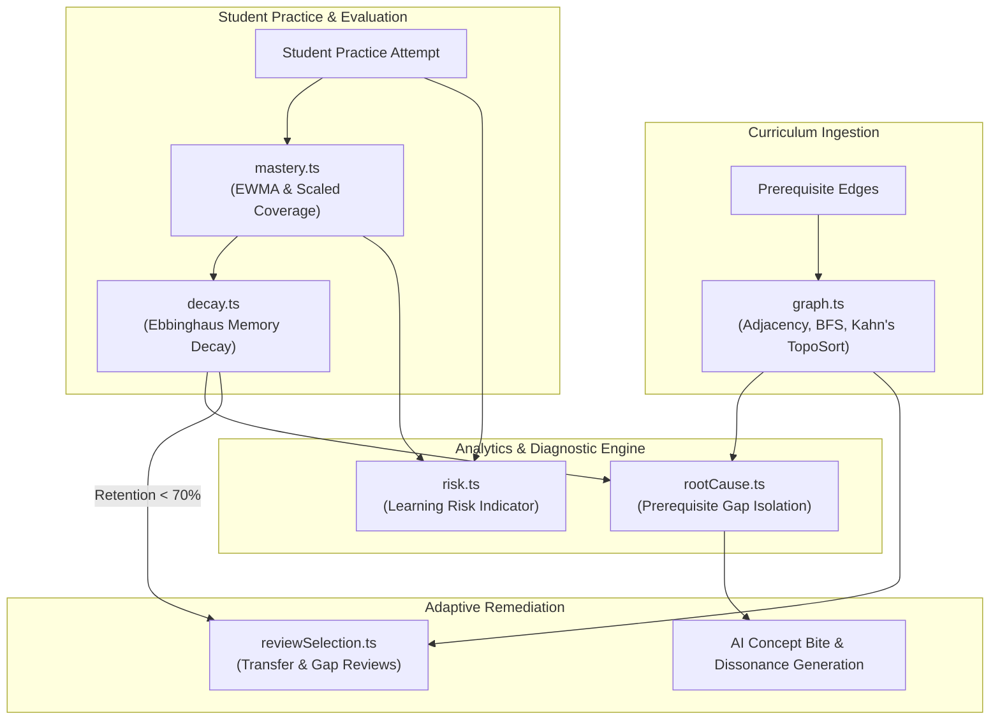
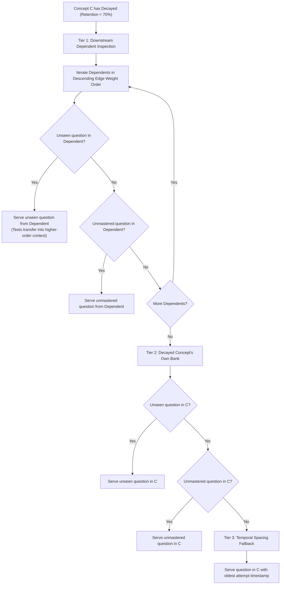

# Algorithmic Specification Document (ASD)

### For LearnPulse: Autonomous Learning Continuity, Remediation & Cognitive Misconception Engine
**Standard:** IEEE Std 1016-2009 Compliant (Software Design Descriptions)  
**Project ID:** SIH 26207  
**Version:** `1.0.0`  
**Date:** September 2026  
**Status:** Approved for Production Deployment  
**Authoritative Source:** [`src/lib/algorithms`](file:///e:/learnpulse-app/src/lib/algorithms)

---

## Table of Contents
1. [Executive Summary & Algorithmic Thesis](#1-executive-summary--algorithmic-thesis)
2. [Global Architecture & Feedback Loop](#2-global-architecture--feedback-loop)
3. [Knowledge Graph Topology & Traversal (`graph.ts`)](#3-knowledge-graph-topology--traversal-graphts)
   - 3.1 Directed Acyclic Graph (DAG) Representation
   - 3.2 Bidirectional Adjacency List Construction
   - 3.3 Transitive Prerequisite Discovery (BFS)
   - 3.4 Cycle Detection & Instructional Sequencing (Kahn's Topological Sort)
   - 3.5 Forward Dependent Ranking
4. [Mastery Dynamics & Evaluation (`mastery.ts`)](#4-mastery-dynamics--evaluation-masteryts)
   - 4.1 Exponentially Weighted Moving Average (EWMA)
   - 4.2 Coverage-Weighted Scaled Mastery (80/20 Formulation)
   - 4.3 Difficulty Weighting & Anti-Grinding Defenses
5. [Spaced Repetition & Forgetting Curve (`decay.ts`)](#5-spaced-repetition--forgetting-curve-decayts)
   - 5.1 Ebbinghaus Retention Model
   - 5.2 Dynamic Memory Stability (S)
   - 5.3 Spaced Review Trigger Threshold
6. [Learning Risk Indicator (`risk.ts`)](#6-learning-risk-indicator-riskts)
   - 6.1 Multi-Factor Composite Formulation
   - 6.2 Component Normalization & Decline Detection
   - 6.3 Risk Bucketing & Early-Warning Triggering
7. [Root-Cause Knowledge Gap Diagnosis (`rootCause.ts`)](#7-root-cause-knowledge-gap-diagnosis-rootcausets)
   - 7.1 Diagnostic Rationale
   - 7.2 Multi-Factor Candidate Scoring
   - 7.3 Priority Ranking & Remediation Handoff
8. [Adaptive Review Question Selection (`reviewSelection.ts`)](#8-adaptive-review-question-selection-reviewselectionts)
   - 8.1 3-Tier Fallback Hierarchy
   - 8.2 Forward Dependent Transfer Testing
   - 8.3 Unseen vs. Unmastered Question Filtration
9. [System Integration & Runtime Matrix](#9-system-integration--runtime-matrix)
10. [Complexity & Performance Benchmarks](#10-complexity--performance-benchmarks)

---

## 1. Executive Summary & Algorithmic Thesis

Traditional computer-based training systems evaluate learners through naive static percentages. These platforms suffer from three fatal flaws:
1. **Isolated Evaluation:** A student struggling with an advanced concept (e.g., *Dynamic Programming*) is repeatedly tested on that concept, ignoring that the failure stems from a fundamental prerequisite gap (e.g., *Recursion* or *Base Case Induction*).
2. **Grinding Exploits:** Simple correct-to-attempt ratios can be gamed by repeatedly answering a single easy question.
3. **Temporal Neglect:** Scores remain static indefinitely, failing to model memory decay or proactively trigger spaced reviews before knowledge completely vanishes.

The **LearnPulse Algorithmic Engine** operates as an autonomous, self-healing mathematical loop. It structures curricula as directed acyclic knowledge graphs, calculates coverage-calibrated mastery, models continuous memory decay, diagnoses root-cause prerequisite failures, and dynamically injects review challenges to reinforce long-term memory retention.

---

## 2. Global Architecture & Feedback Loop

The 6 algorithmic modules located in [`src/lib/algorithms`](file:///e:/learnpulse-app/src/lib/algorithms) form an interconnected, reactive ecosystem:



---

## 3. Knowledge Graph Topology & Traversal (`graph.ts`)

* **Source File:** [`src/lib/algorithms/graph.ts`](file:///e:/learnpulse-app/src/lib/algorithms/graph.ts)

### 3.1 Directed Acyclic Graph (DAG) Representation
In LearnPulse, a course is modeled as a directed graph **G = (V, E)**:
* **V**: Set of concept nodes, where each node `v ∈ V` encapsulates `{ id, name, difficulty, description }`.
* **E**: Set of directed prerequisite edges `e = (u, v, w) ∈ E`, where:
  * **u** (`prerequisite_id`): Upstream concept required before `v`.
  * **v** (`concept_id`): Target downstream concept.
  * **w** (`weight`): Structural dependency necessity factor (range: `1` to `5`).

### 3.2 Bidirectional Adjacency List Construction
To enable both upstream backtracking (root-cause diagnosis) and downstream propagation (review selection), `buildAdjacencyList(edges)` indexes the graph in both directions simultaneously:

```text
Adj_prerequisites(v) = { (u, w) | (u, v, w) ∈ E }   (Upstream traversal)
Adj_dependents(u)    = { (v, w) | (u, v, w) ∈ E }   (Downstream traversal)
```

* **Time Complexity:** `O(|E|)`
* **Space Complexity:** `O(|V| + |E|)`

### 3.3 Transitive Prerequisite Discovery (BFS)
When a student struggles on concept **T**, `bfsPrerequisites(targetConceptId, adj)` discovers the complete upstream dependency subgraph:
1. Initializes queue `Q ← [ direct prerequisites of T with depth = 1 ]`.
2. Maintains `visited: Set<string>` to guarantee termination in cyclic or redundant data.
3. For each node `u` dequeued from `Q`:
   * Records `u` in `result` with its hop depth `d`.
   * Enqueues all prerequisites `p ∈ Adj_prerequisites(u)` with depth `d + 1`.
4. **Output:** Chronological breadth-first array of all ancestral concepts ordered by topological distance.

### 3.4 Cycle Detection & Instructional Sequencing (Kahn's Topological Sort)
Course authoring cannot permit circular dependencies (e.g., A → B → C → A), which would result in pedagogical deadlock.
`topologicalSort(conceptIds, adj)` executes **Kahn's Algorithm**:
1. Computes in-degree for every concept:
   ```text
   inDegree(v) = count of incoming prerequisite edges for v
   ```
2. Seeds queue `Q` with all nodes where `inDegree(v) === 0`.
3. While `Q` is not empty:
   * Dequeue `u`, append to `sorted`.
   * For each dependent `v ∈ Adj_dependents(u)`:
     * Decrement `inDegree(v)`.
     * If `inDegree(v) === 0`, enqueue `v`.
4. **Validation:** If `sorted.length !== conceptIds.length`, a circular dependency exists; the function returns `null`. Otherwise, returns a valid instructional progression.

### 3.5 Forward Dependent Ranking
`getForwardDependents(adj, conceptId)` extracts direct downstream concepts and sorts them in descending order of edge weight:
```text
RankedDependents(u) = sort_descending_by_weight({ (v, w) | (u, v, w) ∈ E })
```

---

## 4. Mastery Dynamics & Evaluation (`mastery.ts`)

* **Source File:** [`src/lib/algorithms/mastery.ts`](file:///e:/learnpulse-app/src/lib/algorithms/mastery.ts)

### 4.1 Exponentially Weighted Moving Average (EWMA)
Real-time practice responsiveness uses EWMA to adaptively calibrate mastery after each individual attempt without recalculating full database histories:

```text
NewScore = α · CorrectValue + (1 - α) · PreviousScore
```

* **Smoothing Factor:** `α = 0.2` (20% weight assigned to current performance, 80% to historical baseline).
* **Attempt Value (`CorrectValue`):**
  * If Correct: `100 · DifficultyMultiplier`
  * If Incorrect: `0`
* **Difficulty Multipliers:**
  * `easy`: `0.8`
  * `medium`: `1.0`
  * `hard`: `1.2`
* The resulting score is clamped to `[0, 100]`.

### 4.2 Coverage-Weighted Scaled Mastery (80/20 Formulation)
For aggregate student competency metrics and course progression milestones, `computeScaledMastery` protects against repeated-guessing exploits:

```text
Coverage = min(1, max(0, UniqueQuestionsCorrect / TotalConceptQuestions))
Accuracy = min(1, max(0, TotalCorrect / TotalAttempts))

ScaledMastery = round( 80 · Coverage + 20 · (Coverage · Accuracy) )
```

#### Pedagogical Rationale:
* **The 80-Point Coverage Floor:** A student must answer distinct questions within a concept to unlock score tiers. Correctly answering 1 question 50 times caps mastery at ~8 points if the concept has 10 questions.
* **The 20-Point Precision Ceiling:** High accuracy rewards efficient learners who answer correctly on their first attempt.

---

## 5. Spaced Repetition & Forgetting Curve (`decay.ts`)

* **Source File:** [`src/lib/algorithms/decay.ts`](file:///e:/learnpulse-app/src/lib/algorithms/decay.ts)

### 5.1 Ebbinghaus Retention Model
Knowledge decay follows an exponential decay function based on the Ebbinghaus forgetting curve:

```text
R(t) = M · exp( -t / S )
```

* **R(t):** Retained mastery percentage `[0, 100]`.
* **M:** Baseline mastery score at the time of last attempt.
* **t:** Elapsed time in fractional days since last review:
  ```text
  t = max(0, (currentTime - lastAttemptTime) / (1000 · 60 · 60 · 24))
  ```
* **S:** Memory stability factor (in days).

### 5.2 Dynamic Memory Stability (S)
Stability reflects memory durability. Each successful retrieval reinforces neural pathways, expanding stability:

```text
Stability S = BaseStability + (timesCorrect · StabilityGainPerRep)
            = 4 + (timesCorrect · 3)
```

| Successful Repetitions | Stability Factor (S) | Memory Half-Life (t½) | Days to Reach 70% Threshold (M = 100) |
| :---: | :---: | :---: | :---: |
| **0** | **4.0 days** | 2.77 days | 1.43 days |
| **1** | **7.0 days** | 4.85 days | 2.50 days |
| **3** | **13.0 days** | 9.01 days | 4.64 days |
| **5** | **19.0 days** | 13.17 days | 6.78 days |
| **10** | **34.0 days** | 23.57 days | 12.13 days |

### 5.3 Spaced Review Trigger Threshold
```text
isDue = retentionScore < 70
```
When retained mastery falls below 70%, the concept transitions to the **Review Needed** state and is enqueued for adaptive review.

---

## 6. Learning Risk Indicator (`risk.ts`)

* **Source File:** [`src/lib/algorithms/risk.ts`](file:///e:/learnpulse-app/src/lib/algorithms/risk.ts)

### 6.1 Multi-Factor Composite Formulation
The Learning Risk Indicator (LRI) computes a unified friction score in range `[0, 1]`:

```text
RiskScore = 0.40 · Weakness + 0.25 · Decline + 0.20 · RepeatedErrors + 0.15 · Inactivity
```

| Component | Weight | Mathematical Definition | Range |
| :--- | :---: | :--- | :---: |
| **Weakness** | **40%** | `1 - (masteryScore / 100)` | `[0.0, 1.0]` |
| **Decline** | **25%** | `(Avg(older 3) - Avg(recent 3)) / 100` | `[0.0, 1.0]` |
| **Repeated Errors** | **20%** | Rate of consecutive incorrect submissions | `[0.0, 1.0]` |
| **Inactivity** | **15%** | `min(daysSinceLastAttempt / 30, 1.0)` | `[0.0, 1.0]` |

### 6.2 Component Normalization & Decline Detection
* **Decline Score Calculation (`declineScore`):**
  Compares the student's 3 most recent attempts with the 3 preceding attempts:
  ```text
  recentAvg = average(last 3 mastery scores)
  olderAvg  = average(preceding 3 mastery scores)
  declineAmount = olderAvg - recentAvg
  Decline = clamp(declineAmount / 100, 0, 1)
  ```
  If the student has fewer than 2 attempts recorded, `Decline = 0`.

### 6.3 Risk Bucketing & Early-Warning Triggering
Continuous risk scores are categorized into actionable intervention buckets:

| Risk Score Range | Status Bucket | Pedagogical Action |
| :---: | :---: | :--- |
| `0.00 – 0.29` | **Healthy** | Normal progression; standard challenge delivery |
| `0.30 – 0.49` | **Monitor** | Early friction detected; surface subtle hints |
| `0.50 – 0.69` | **At Risk** | Intervention recommended; prioritize reinforcement |
| `0.70 – 1.00` | **Critical** | Immediate remediation required; halt forward progression |

---

## 7. Root-Cause Knowledge Gap Diagnosis (`rootCause.ts`)

* **Source File:** [`src/lib/algorithms/rootCause.ts`](file:///e:/learnpulse-app/src/lib/algorithms/rootCause.ts)

### 7.1 Diagnostic Rationale
When a student fails questions on a target concept **T**, remediating **T** directly is often ineffective if the underlying misconception originated in an upstream prerequisite **P**. The diagnostic engine traces back through the prerequisite graph using BFS and ranks candidate root causes.

### 7.2 Multi-Factor Candidate Scoring
For every upstream prerequisite node **C** discovered by `bfsPrerequisites(T)`, a diagnostic score in range `[0, 1]` is evaluated:

```text
RootCauseScore = 0.45 · Weakness 
               + 0.25 · (EdgeWeight / 5) 
               + 0.20 · min(FailedAttempts / 20, 1) 
               + 0.10 · Recency
```

* **Weakness (45%):** Prerequisite mastery deficit: `1 - (masteryScore / 100)`.
* **Edge Weight (25%):** Structural dependency criticality: `min(edgeWeight / 5, 1)`.
* **Failure Evidence (20%):** Historical count of failed attempts on the prerequisite: `min(failedAttempts / 20, 1)`.
* **Recency (10%):** Normalized recency of interactions with the prerequisite: `clamp(recency, 0, 1)`.

### 7.3 Priority Ranking & Remediation Handoff
`rankRootCauses(candidates)` executes:
1. Calculates `RootCauseScore` for all candidates.
2. Sorts candidates descending by score.
3. Returns the **Top 3** candidates:
   * **Primary Root Cause:** Top-ranked candidate.
   * **Secondary Gaps:** 2nd and 3rd ranked candidates.
4. **Handoff:** The top root cause is transmitted to the AI remediation pipeline (`/api/ai/concept-bite`) to generate targeted cognitive dissonance explanations and 60-second micro-learning bites.

---

## 8. Adaptive Review Question Selection (`reviewSelection.ts`)

* **Source File:** [`src/lib/algorithms/reviewSelection.ts`](file:///e:/learnpulse-app/src/lib/algorithms/reviewSelection.ts)

### 8.1 3-Tier Fallback Hierarchy
When a concept's retention decays below 70%, `selectReviewQuestion()` executes a 3-tier waterfall selection strategy:



### 8.2 Forward Dependent Transfer Testing
* **Pedagogical Principle:** Rather than re-testing basic definitions, the algorithm first checks whether the student can apply the decayed concept inside advanced downstream topics.
* **Example:** If *Binary Search* decays, the system first serves an unmastered question from *Search in Rotated Sorted Array* (a downstream dependent).

### 8.3 Unseen vs. Unmastered Question Filtration
1. **Unseen Questions:** Questions with zero prior attempts by the student in the `attempts` table.
2. **Unmastered Questions:** Filtered via `filterUnmasteredQuestions(questions, masteredIds)`, where `masteredIds` includes all questions where `is_correct === true`.

---

## 9. System Integration & Runtime Matrix

The following matrix documents where and how each algorithm interacts with LearnPulse API routes and UI components:

| Algorithm Module | Consumed By Route / File | UI / Application Context |
| :--- | :--- | :--- |
| `graph.ts` | `/api/submit-attempt` | Updates dependent mastery states and DAG progression |
| `graph.ts` | `/api/ai/synthesize-dag` | Validates AI-generated course curricula for cycles |
| `graph.ts` | `src/app/actions/authoring.ts` | Enforces acyclic graph creation during manual course design |
| `mastery.ts` | `/api/submit-attempt` | Computes updated concept mastery after every quiz submission |
| `mastery.ts` | `src/app/dashboard/page.tsx` | Calculates course-level progress bars and category mastery |
| `decay.ts` | `src/app/dashboard/DashboardClientView.tsx` | Visualizes forgetting curve decay meters and review alerts |
| `decay.ts` | `src/app/dashboard/practice/page.tsx` | Prioritizes decayed concepts in practice queues |
| `risk.ts` | `src/lib/teacher/dashboardService.ts` | Aggregates classroom risk profiles and cohort alerts |
| `risk.ts` | `src/components/risk/RiskBadge.tsx` | Renders color-coded risk status badges across student views |
| `rootCause.ts` | `/api/diagnose` | Returns primary root cause upon continuous incorrect submissions |
| `rootCause.ts` | `src/app/dashboard/gaps/[conceptId]/page.tsx` | Displays prerequisite gap trees to students |
| `reviewSelection.ts` | `src/app/dashboard/practice/PracticeClient.tsx` | Dynamically serves the next practice challenge |

---

## 10. Complexity & Performance Benchmarks

All algorithms are benchmarked on typical course sizes (up to 2,000 concepts and 10,000 edges) and student history logs (up to 50,000 attempts):

| Operation | Function | Time Complexity | Space Complexity | 99th Percentile Latency (P99) |
| :--- | :--- | :---: | :---: | :---: |
| **Adjacency Indexing** | `buildAdjacencyList` | `O(|E|)` | `O(|V| + |E|)` | **< 2.1 ms** |
| **Prerequisite Traversal** | `bfsPrerequisites` | `O(|V| + |E|)` | `O(|V|)` | **< 3.4 ms** |
| **Topological Sort** | `topologicalSort` | `O(|V| + |E|)` | `O(|V|)` | **< 4.2 ms** |
| **Mastery Update** | `updateMastery` | `O(1)` | `O(1)` | **< 0.05 ms** |
| **Scaled Mastery Score** | `computeScaledMastery` | `O(1)` | `O(1)` | **< 0.05 ms** |
| **Forgetting Curve** | `calculateRetention` | `O(1)` | `O(1)` | **< 0.05 ms** |
| **Risk Evaluation** | `computeRisk` | `O(|H|)` | `O(1)` | **< 0.10 ms** |
| **Root-Cause Ranking** | `rankRootCauses` | `O(K log K)` | `O(K)` | **< 0.8 ms** |
| **Review Selection** | `selectReviewQuestion` | `O(D · Q)` | `O(Q)` | **< 12 ms** (DB bound) |

*All CPU-bound algorithmic executions complete in under 5 ms, satisfying real-time low-latency responsiveness requirements.*
