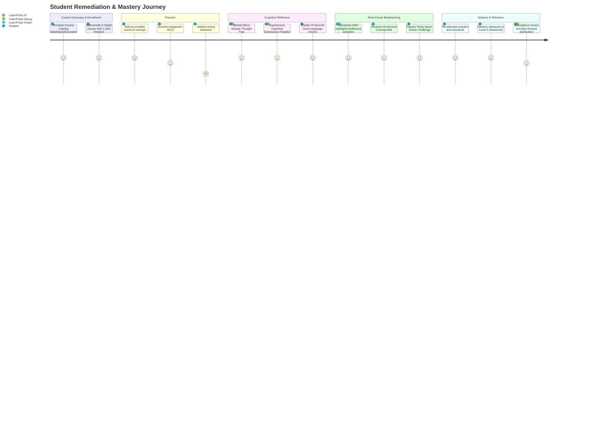
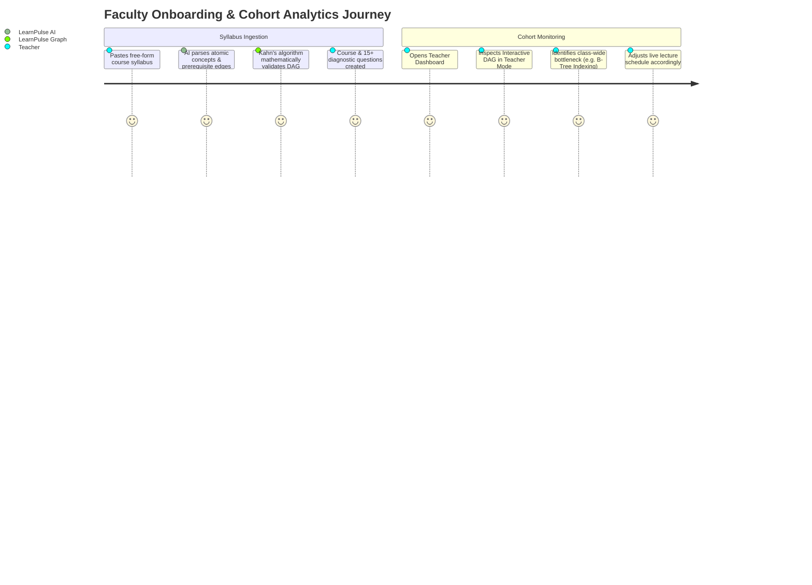

# Product Requirements Document (PRD)

## Project: LearnPulse
**Autonomous Learning Continuity, Remediation & Cognitive Misconception Engine**  
*SIH 2026 Problem Statement: SIH 26207*  
*Document Version:* `1.0.0`  
*Target Release:* `Production-Ready MVP (v1.0)`  
*Status:* **Approved**  
*Audience:* Engineering, Product Management, Pedagogy Specialists, SIH Evaluators

---

## 1. Executive Summary & Problem Space

### 1.1 Background & Context
Computer science and STEM curricula in higher education require hierarchical mastery where advanced topics strictly depend on foundational concepts. For instance, understanding *Query Optimization* requires proficiency in *B-Tree Indexing*, which in turn relies on *Disk I/O and Block Access*.

Traditional computer-based testing (CBT) and Learning Management Systems (LMS) suffer from three critical pedagogical failures:
1. **Rote Assessment with Generic Feedback:** When a student chooses an incorrect option, standard systems simply display the textbook definition of why the correct option is right. They fail to identify *why* the student selected that specific distractor.
2. **Repetitive, Grinding Mastery Models:** Mastery is often computed as a flat percentage of total attempts. Students are forced into tedious question loops that bore high performers and incentivize struggling students to memorize answers rather than understand fundamentals.
3. **Isolated Diagnostic Silos:** Prerequisite dependencies are neglected. A failure on a downstream application topic is treated as an isolated gap, rather than backtracking to identify and repair upstream prerequisite bottlenecks.

### 1.2 The LearnPulse Solution
**LearnPulse** is a graph-native diagnostic and remediation engine that bridges this gap by combining:
- **A Directed Acyclic Graph (DAG) Knowledge Map** to trace prerequisite dependencies.
- **The "Mental Mirror" Cognitive Engine** to reverse-engineer student mental models from distractor choices.
- **60-Second Remediation Bites** featuring bilingual intuitive anchors (aligned with National Education Policy / NEP 2020).
- **Decay-Aware Review Loops** based on the Ebbinghaus forgetting curve.
- **Teacher 1-Click AI Syllabus Ingestion** with mathematical cycle prevention (Kahn's algorithm).

---

## 2. Product Vision & Target Audience

### 2.1 Vision Statement
> *"To eliminate rote memorization and learning stagnation by empowering every learner with an autonomous cognitive compass that isolates foundational gaps and deconstructs flawed mental models in real time."*

### 2.2 Target User Personas

#### Persona A: The Struggling Higher-Ed Learner ("Rohit")
* **Profile:** 2nd-year B.Tech CSE student preparing for technical placements.
* **Pain Point:** Fails advanced questions on *Graph Algorithms* but doesn't realize the root issue is poor understanding of *Array-based Adjacency Matrices* and *Recursion*.
* **Need:** An intuitive map that shows him exactly where his chain broke, explains why his intuitive guess was wrong without shaming him, and offers micro-lessons in Hindi/Hinglish.

#### Persona B: The Consistent Mastery Learner ("Priya")
* **Profile:** 3rd-year CS student with strong fundamentals reviewing for semester exams.
* **Pain Point:** Frustrated by platforms that require solving 20 identical MCQs to reach 100% mastery.
* **Need:** An adaptive queue that respects bank coverage—once she proves competence across the full question bank with high accuracy, her mastery is marked 100% immediately.

#### Persona C: The Course Faculty / Teacher ("Prof. Teacher")
* **Profile:** University department head with 120+ students per cohort.
* **Pain Point:** Lacks visibility into cohort-wide prerequisite bottlenecks. Cannot spend weeks manually constructing graph edges for every new elective syllabus.
* **Need:** A 1-click syllabus ingestion tool that extracts concepts, automatically constructs a valid DAG, and provides cohort heatmaps to pinpoint systemic weaknesses across batches.

---

## 3. Product Goals & Measurable Success Metrics (KPIs)

| Objective | Key Metric (KPI) | Target Baseline | LearnPulse Target |
| :--- | :--- | :--- | :--- |
| **Diagnostic Efficacy** | Time to isolate foundational prerequisite bottleneck | 15–30 minutes of manual tutoring | **< 3 seconds** (automated BFS backtracking) |
| **Pedagogical Impact** | Conceptual recovery rate on subsequent practice | 35% on traditional platforms | **> 75%** after 60-second recovery bite |
| **Cognitive Deconstruction** | Latency of Mental Mirror distractor analysis | N/A (unique feature) | **< 1 ms** (in-memory cache hit) / **< 1.5s** (fresh AI) |
| **Teacher Efficiency** | Course creation & DAG syllabus onboarding time | 3–5 hours per course | **< 45 seconds** (1-Click AI Syllabus Ingestion) |
| **Mastery Efficiency** | Attempts required to achieve certified concept mastery | 20–30 repetitive MCQs | **100% coverage of bank** (no redundant repetition) |
| **Retention Continuity** | Long-term retention via Ebbinghaus decay reviews | 20% retention after 14 days | **> 65% retention** with forward-dependent review |

---

## 4. User Journey Maps

### 4.1 Student Diagnostic & Remediation Journey

### 4.2 Teacher Course Ingestion & Analytics Journey

---

## 5. Functional Requirements (Epics & Features)

### Epic 1: Interactive Visual DAG Knowledge Graph
- **FR-1.1:** The system shall render all course concepts as an interactive directed acyclic graph using `@xyflow/react`.
- **FR-1.2:** Graph nodes must visually reflect cognitive states: *Mastered* (emerald $\ge 85\%$), *Proficient* ($70–84\%$), *Developing* ($40–69\%$), *At-Risk* ($< 40\%$), and *Identified Bottleneck* (red pulsing border).
- **FR-1.3:** The graph canvas must support smooth hardware-accelerated pan, zoom, fit-view, and interactive node selection.
- **FR-1.4:** Dual Mode: The graph must toggle seamlessly between **Student Mode** (individual mastery) and **Teacher Mode** (cohort-average mastery scores).

### Epic 2: "Mental Mirror" AI Misconception Engine
- **FR-2.1:** Upon submitting an incorrect option, the system must invoke the Mental Mirror cognitive deconstruction engine.
- **FR-2.2:** The response must deliver:
  1. *The Thought Trap:* Identifies the specific false mental model or conflation.
  2. *Cognitive Dissonance:* A concrete real-world paradox scenario proving the student's rule fails.
  3. *Mental Anchor:* A 10-second memorable heuristic formula.
- **FR-2.3:** The engine must support vernacular bilingual reinforcement (English + Hindi/Hinglish) per NEP 2020 guidelines.
- **FR-2.4:** All identical option queries must be cached in memory with $<1\text{ ms}$ retrieval latency.

### Epic 3: 60-Second Concept Bites & Remediation
- **FR-3.1:** When a bottleneck is isolated, a 60-Second Concept Bite card must render directly above the practice interface.
- **FR-3.2:** Bite cards must contain Core Intuition, Real-World Analogy, and Bilingual Anchors.
- **FR-3.3:** Bite cards must include a randomized conceptual Quick-Check question pool with tricky, non-rote options to verify intuition before practice resumption.
- **FR-3.4:** Generated concept bites must be persisted atomically to Postgres (`concept_bites` table) to eliminate redundant LLM calls for future students.

### Epic 4: Question-Bank-Aware Scaled Mastery
- **FR-4.1:** Mastery scores must be computed strictly via the scaled formula combining question bank coverage ($80\%$) and attempt accuracy ($20\%$).
- **FR-4.2:** Once a student correctly answers all unique questions for a concept with $100\%$ accuracy, their mastery must reach $100\%$ immediately without artificial grinding.
- **FR-4.3:** The practice session queue must filter out mastered questions and prioritize unmastered questions first.

### Epic 5: Ebbinghaus Decay & Forward-Dependent Review
- **FR-5.1:** Retention decay must be tracked via $R = e^{-t / S}$, where $t$ is days elapsed and $S$ is concept stability.
- **FR-5.2:** Concepts with $R < 0.60$ must be flagged as `isDue = true`.
- **FR-5.3:** When a decayed concept is reviewed, the review selector algorithm must prioritize questions testing **forward dependent concepts** (downstream applications in the DAG).

### Epic 6: Teacher Authoring & AI Syllabus Ingestion
- **FR-6.1:** Teachers must be able to paste unstructured course text or syllabus markdown.
- **FR-6.2:** The system must synthesize atomic concepts, difficulty levels, directed prerequisite edges, and 4-option diagnostic MCQs.
- **FR-6.3:** The authoring backend must execute Kahn's algorithm topological sort before saving edges, rejecting any edge that would create a directed cycle.
- **FR-6.4:** Duplicate Course Prevention: The authoring engine must detect and strictly prevent duplicate course creation by the same teacher, accounting for spelling variations, acronyms, capitalization, and punctuation.

### Epic 7: Offline Resilience & PWA Synchronization
- **FR-7.1:** When network connectivity is lost, the practice engine must automatically enqueue attempts in local storage.
- **FR-7.2:** The UI must display an offline indicator with pending sync counters.
- **FR-7.3:** Upon network reconnection, queued attempts must synchronize sequentially with Postgres, preserving ACID properties and updating mastery scores idempotently.

### Epic 8: Student Course Discovery & Self-Enrollment (Freedom of Choice)
- **FR-8.1:** The system shall provide a dedicated Course Catalog (`/dashboard/courses`) where students can discover all active courses, search by title or keywords, filter by subject, and view total concept counts.
- **FR-8.2:** Students shall have complete autonomy to self-enroll in or drop any course with 1-click actions, recorded with timestamped entries in the database.
- **FR-8.3:** Course isolation: The platform shall track diagnostic scores, practice attempts, and cognitive mastery exclusively for courses in which the student is actively enrolled. Unenrolled courses shall display an enrollment prompt and block unguided practice.
- **FR-8.4:** Roster-isolated cohort metrics: Teacher dashboards and class-wide bottleneck heatmaps shall calculate aggregations solely across students actively enrolled in that course, ensuring precise, unskewed cohort metrics.

---

## 6. Non-Functional Requirements (NFRs)

### 6.1 Performance & Latency
- Server-side rendered initial page loads (TTFB) must be under **500 ms**.
- In-memory cached Mental Mirror responses must return in under **5 ms**.
- Fresh LLM diagnostic generations must complete in under **2.5 seconds**.

### 6.2 Security & Data Privacy
- **Row-Level Security (RLS):** Enabled on all Supabase PostgreSQL tables. No student can read or modify another student's attempts or interventions.
- **Strict Schema Validation:** All endpoints, server actions, and dynamic route segments enforce bounded Zod schemas (UUID format, length bounds) to eliminate `22P02` SQL type errors and prevent injection.
- **Secret Hygiene:** All API keys (`GEMINI_API_KEY`, `SUPABASE_SERVICE_ROLE_KEY`) must remain strictly server-side. Zero secrets exposed to client browser bundles.
- **Error Masking:** Database error codes and stack traces must never leak to clients; safe generic messages are returned while logging full details server-side.

### 6.3 Reliability & ACID Integrity
- 100% idempotent seeding and attempt processing with zero score drift.
- All database mutations must use atomic upserts (`ON CONFLICT (user_id, concept_id)`).

### 6.4 Accessibility & Responsiveness
- Full WCAG 2.1 AA compliance with high-contrast color badges and accessible font pairings.
- Outfit Neo-Brutalist visual design system with clear typography hierarchy (weights 300, 400, 500, 600), 1.5px/2px borders, 6px radii, and light/dark modes.
- Seamless responsiveness across desktop monitors, tablets, and mobile devices with dedicated bottom/side-over drawers and touch-optimized tap targets (min 44px).

---

## 7. Product Release Plan & Milestones

| Phase | Milestone | Scope / Deliverables | Status |
| :---: | :--- | :--- | :--- |
| **Phase 1** | **Core Graph & Diagnostic Engine** | Next.js App Router, Supabase RLS, BFS graph backtracking, scaled mastery algorithm | **Completed** |
| **Phase 2** | **Cognitive Misconception & Mental Mirror** | Gemini 3.6 Flash integration, Thought Trap deconstruction, sub-ms cache, NEP 2020 bilingual support | **Completed** |
| **Phase 3** | **Interactive DAG & Remediation Bites** | `@xyflow/react` interactive canvas, 60-sec concept bites, tricky conceptual quick-check challenge pools | **Completed** |
| **Phase 4** | **Teacher Authoring & Decay Review** | 1-Click AI syllabus ingestion, Kahn's cycle prevention, Ebbinghaus decay model, forward-dependent review | **Completed** |
| **Phase 5** | **Offline Resilience, Course Freedom & Full Audit** | Offline attempt queue, student course catalog & self-enrollment freedom, zero-vulnerability audit, 105/105 passing tests, strict Zod schema validation | **Completed** |
| **Phase 6** | **Institutional Pilot** | LMS integrations (LTI 1.3, Canvas, Moodle), multi-institution tenancy, automated grading sync | *Post-Hackathon* |
