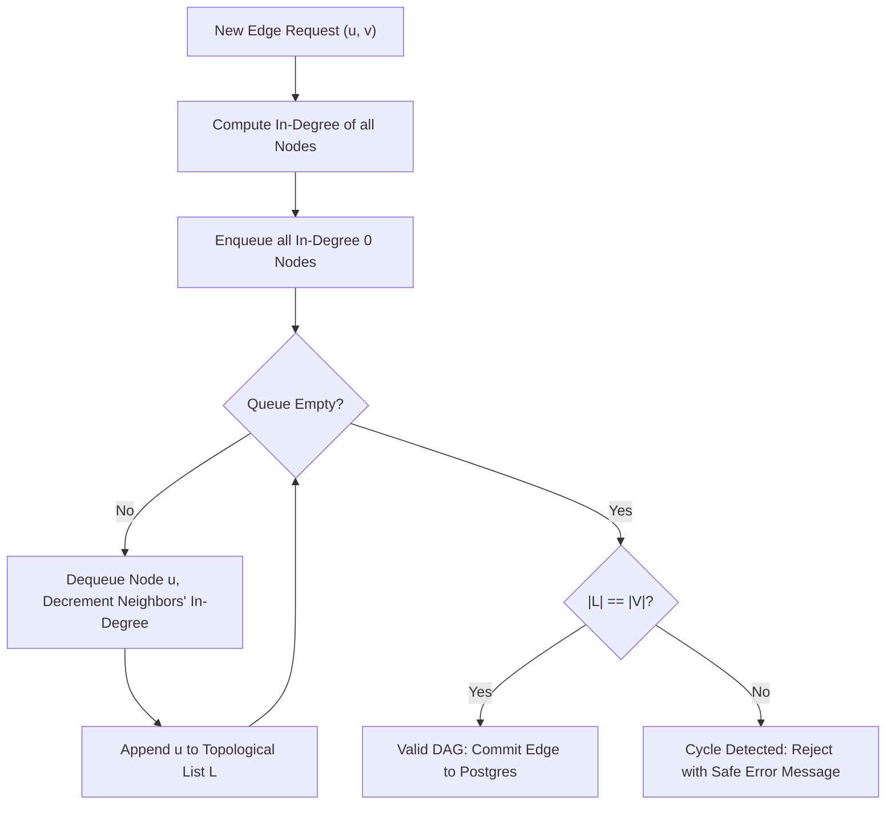
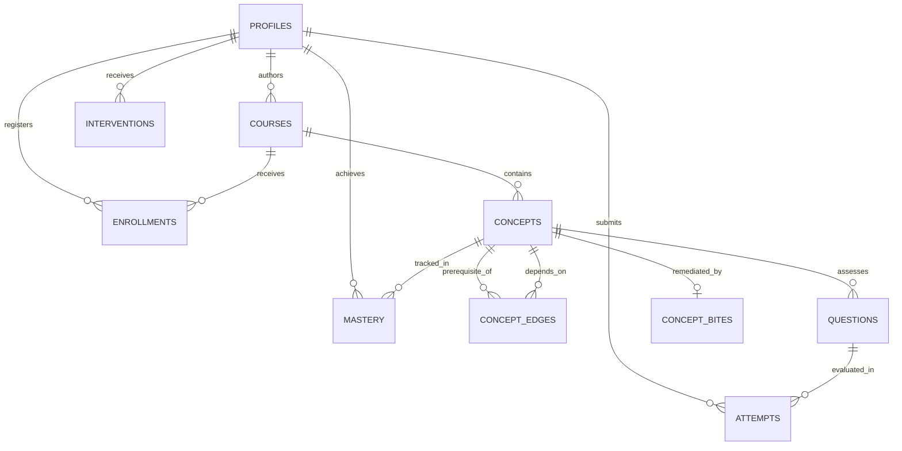

# Software Requirements Specification (SRS)
### For LearnPulse: Autonomous Learning Continuity, Remediation & Cognitive Misconception Engine
**Standard:** IEEE Std 830-1998 Compliant  
**Project ID:** SIH 26207  
**Version:** `1.0.0`  
**Date:** September 2026  
**Status:** Approved for Production Deployment  

---

## Table of Contents
1. [Introduction](#1-introduction)
   - 1.1 Purpose
   - 1.2 Document Conventions
   - 1.3 Intended Audience and Reading Suggestions
   - 1.4 Project Scope
   - 1.5 References
2. [Overall Description](#2-overall-description)
   - 2.1 Product Perspective
   - 2.2 Product Functions
   - 2.3 User Classes and Characteristics
   - 2.4 Operating Environment
   - 2.5 Design and Implementation Constraints
   - 2.6 User Documentation
   - 2.7 Assumptions and Dependencies
3. [External Interface Requirements](#3-external-interface-requirements)
   - 3.1 User Interfaces
   - 3.2 Hardware Interfaces
   - 3.3 Software Interfaces
   - 3.4 Communications Interfaces
4. [System Features & Functional Requirements](#4-system-features--functional-requirements)
   - 4.1 Directed Acyclic Graph (DAG) Prerequisite Engine
   - 4.2 Scaled Mastery & Question-Bank-Aware Queue
   - 4.3 "Mental Mirror" AI Cognitive Misconception Engine
   - 4.4 60-Second Concept Bite & Remediation Engine
   - 4.5 Ebbinghaus Retention Decay & Review Selection
   - 4.6 Teacher Course Authoring & AI Syllabus Ingestion
   - 4.7 Offline Practice Queue & Synchronizer
   - 4.8 Student Course Discovery & Self-Enrollment
5. [Other Non-Functional Requirements](#5-other-non-functional-requirements)
   - 5.1 Performance Requirements
   - 5.2 Safety Requirements
   - 5.3 Security Requirements
   - 5.4 Software Quality Attributes
6. [Data Model & Database Specifications](#6-data-model--database-specifications)
   - 6.1 Entity-Relationship (ER) Architecture
   - 6.2 Table DDL Specifications & Constraints
   - 6.3 Row-Level Security (RLS) Policy Specifications
7. [Traceability Matrix & Verification Plan](#7-traceability-matrix--verification-plan)

---

## 1. Introduction

### 1.1 Purpose
This Software Requirements Specification (SRS) provides a complete, unambiguous specification of the functional and non-functional requirements for the **LearnPulse** learning platform. It serves as the primary technical contract for software engineers, QA teams, pedagogical evaluators, and system architects.

### 1.2 Document Conventions
- **Requirement Identifiers:** All functional requirements use the syntax `FR-<Category>-<Number>`.
- **Non-Functional Requirements:** Syntax `NFR-<Category>-<Number>`.
- **Prioritization Keywords:**
  - `SHALL` / `MUST`: Mandatory core requirement for production compliance.
  - `SHOULD`: Recommended enhancement.
  - `MAY`: Optional feature.

### 1.3 Intended Audience
- **Fullstack Developers & ML Engineers:** For implementing backend algorithms, API contracts, and UI components.
- **QA & Testing Engineers:** For automated test verification against Vitest suites and end-to-end integration tests.
- **SIH Evaluators & Academic Reviewers:** For reviewing algorithmic correctness, architectural robustness, and pedagogical alignment.

### 1.4 Project Scope
LearnPulse is an autonomous educational engine designed to eliminate rote memorization and unaddressed prerequisite gaps in technical higher education. The system provides real-time prerequisite backtracking via directed acyclic graphs, cognitive misconception reverse-engineering via Gemini 3.6 Flash, 60-second recovery bites, Ebbinghaus forgetting curve spaced reviews, teacher 1-click syllabus ingestion, and offline resilience.

### 1.5 References
1. IEEE Std 830-1998: *IEEE Recommended Practice for Software Requirements Specifications*.
2. Kahn, A. B. (1962): *Topological sorting of large networks*. Communications of the ACM, 5(11), 558-562.
3. Ebbinghaus, H. (1885): *Memory: A Contribution to Experimental Psychology*.
4. National Education Policy (NEP 2020), Ministry of Education, Government of India: *Mother tongue and multilingual pedagogical reinforcement guidelines*.

---

## 2. Overall Description

### 2.1 Product Perspective
LearnPulse is a cloud-native, responsive web application operating on a decoupled client-server architecture:
- **Client Tier:** Next.js 16 App Router with React 19, Tailwind CSS v4, and `@xyflow/react` hardware-accelerated interactive canvas.
- **Application Tier:** Server Components, Server Actions, and Next.js Route Handlers with strict runtime Zod validation.
- **Algorithmic Engine:** Pure TypeScript algorithmic modules for BFS graph backtracking, Kahn's topological sort, scaled mastery computation, and Ebbinghaus decay modeling.
- **Data & Intelligence Tier:** Supabase PostgreSQL 15 with Row-Level Security (RLS) and Google Gemini 3.6 Flash AI.

### 2.2 Product Functions
1. **Interactive DAG Graph Visualization:** Hardware-accelerated visual representation of course prerequisites with node color-coding based on live mastery scores.
2. **Deterministic Prerequisite Backtracking:** Instant BFS traversal of ancestor dependencies to isolate root-cause bottlenecks when students fail assessments.
3. **Cognitive Misconception Analysis ("Mental Mirror"):** Reverse-engineering the student's flawed mental model from chosen distractor options.
4. **Bilingual Remediation Micro-Lessons:** 60-second recovery bites with English + Hindi/Hinglish anchors and tricky conceptual challenge pools.
5. **Question-Bank-Aware Scaled Mastery:** Eliminating rote grinding by awarding 100% mastery upon complete question bank coverage with high accuracy.
6. **Decay-Aware Review Spacing:** Calculating retention probability and scheduling forward-dependent review questions for decayed concepts.
7. **Teacher 1-Click AI Syllabus Ingestion:** Auto-generating concepts, edges, and questions from unstructured course outlines with cycle rejection.
8. **Offline Resilience & Auto-Sync:** Queueing practice attempts during network drops and syncing idempotently upon reconnection.
9. **Student Course Discovery & Autonomous Self-Enrollment:** Full course catalog exploration with 1-click enroll/unenroll, isolating student diagnostic tracking and preserving pure cohort roster metrics for teachers.

### 2.3 User Classes and Characteristics
- **Student User:** Accesses learning dashboard, practice sessions, visual knowledge graphs, gap diagnoses, and 60-second recovery bites.
- **Teacher / Faculty User:** Manages courses, authors concepts and edges, utilizes AI syllabus ingestion, and views class-wide cohort gap heatmaps.
- **System Administrator:** Oversees database integrity, monitors API telemetry, and manages platform quotas.

### 2.4 Operating Environment
- **Server:** Node.js v20.x or v22.x on Linux/macOS/Vercel Serverless Edge Runtime.
- **Database:** Supabase PostgreSQL 15+ with SSL and RLS enabled.
- **Client Browsers:** Modern evergreen browsers: Chromium 110+, Firefox 110+, Safari 16+, Edge 110+ on Desktop, Tablet, and Mobile.

### 2.5 Design and Implementation Constraints
1. **Strict Modern TypeScript:** Compiled targeting `ES2022` with zero implicit or explicit `any` types permitted across the codebase (`--strict` mode, zero emit errors).
2. **ESLint & Quality Compliance:** Zero lint warnings or errors permitted in production builds (`npm run lint`), verified by Vitest ESM test runners (`vitest.config.mjs`).
3. **Secret Protection & Dependency Audits:** No API keys (`GEMINI_API_KEY`, `SUPABASE_SERVICE_ROLE_KEY`) may be exposed to browser bundles; dependencies must maintain a 0-vulnerability baseline (`npm audit`).
4. **Data Consistency & Schema Validation:** Every input is validated against strict Zod schemas with bounded lengths; all mastery and attempt updates must preserve ACID properties with atomic upsert operations.

---

## 3. External Interface Requirements

### 3.1 User Interfaces
- **UI-1 App Shell:** Responsive layout featuring collapsible navigation sidebar, course selector dropdown, and live user profile state.
- **UI-2 Visual DAG Canvas:** `@xyflow/react` interactive canvas supporting zoom (0.2x to 2.5x), smooth pan, mini-map, background grid, and node selection modal.
- **UI-3 Quiz Practice Interface:** Dynamic MCQ card rendering LaTeX/code snippets, instant feedback state, Mental Mirror drawer, and progress bar.
- **UI-4 Concept Bite Drawer:** Accordion card displaying Core Intuition, Real-World Analogy, Dual-Language Anchors, and interactive Quick-Check.
- **UI-5 Teacher Ingestion Modal:** Markdown/text input modal with real-time status spinners and DAG preview before commit.
- **UI-6 Course Catalog Interface:** Grid-based course exploration with real-time search, subject filter chips, live enrollment status badges, and 1-click enroll/drop triggers.

### 3.2 Hardware Interfaces
No specialized hardware required; runs standard WebGL/Canvas 2D on client GPUs for smooth node rendering.

### 3.3 Software Interfaces
- **Supabase PostgreSQL Interface:** Communicates via PostgREST and `@supabase/supabase-js` using connection pooling and RLS-scoped JWTs.
- **Google Gemini 3.6 Flash Interface:** Communicates via `@google/genai` SDK using structured JSON schema output (`responseMimeType: "application/json"`).

### 3.4 Communications Interfaces
- **Protocols:** HTTPS over TLS 1.3 for all client-to-server and server-to-external requests.
- **API Formats:** Strict JSON request/response bodies validated against Zod schemas.

---

## 4. System Features & Functional Requirements

### 4.1 Directed Acyclic Graph (DAG) Prerequisite Engine

#### Functional Requirements
- **FR-DAG-01:** The system SHALL represent course concepts as vertices $V$ and prerequisite relationships as directed edges $E = (u, v)$ where $u$ is a direct prerequisite of $v$.
- **FR-DAG-02:** The system SHALL construct the directed adjacency list in $O(V + E)$ time via a single database query.
- **FR-DAG-03:** The system SHALL execute Kahn's topological sorting algorithm on the server prior to edge creation:
  - If the topological order length $|L| \ne |V|$, the edge SHALL be rejected with HTTP 400 (`"Cycle detected: Adding this prerequisite creates a circular dependency"`).
- **FR-DAG-04:** When a student requests diagnosis for concept $C$, the system SHALL execute Breadth-First Search (BFS) backtracking across all ancestor nodes to compile candidate root causes.



---

### 4.2 Scaled Mastery & Question-Bank-Aware Queue

#### Functional Requirements
- **FR-MST-01:** The system SHALL compute concept mastery using the scaled coverage formula:
  $$\text{Coverage} = \min\left(1, \frac{U_{\text{correct}}}{N_{\text{total}}}\right), \quad \text{Accuracy} = \frac{A_{\text{correct}}}{A_{\text{total}}}$$
  $$\text{Mastery Score} = \text{round}\Big(\text{Coverage} \times (80 + 20 \times \text{Accuracy})\Big)$$
- **FR-MST-02:** When $U_{\text{correct}} = N_{\text{total}}$ and $A_{\text{correct}} = A_{\text{total}}$, the computed mastery score SHALL equal 100%.
- **FR-MST-03:** The practice question selector SHALL filter out previously mastered questions, ensuring the student is served unseen questions until all unique questions in the bank are mastered.
- **FR-MST-04:** The system SHALL classify mastery scores into 4 educational tiers:
  - Level 1 (Getting Started): $0 - 39\%$
  - Level 2 (Developing): $40 - 69\%$
  - Level 3 (Proficient): $70 - 84\%$
  - Level 4 (Mastered): $85 - 100\%$

---

### 4.3 "Mental Mirror" AI Cognitive Misconception Engine

#### Functional Requirements
- **FR-MM-01:** When a student submits an incorrect option key $K_{\text{selected}}$, the system SHALL call the misconception endpoint `/api/ai/misconception`.
- **FR-MM-02:** The system SHALL query an in-memory cache keyed by `${questionId}_${selectedKey}`. If present, the cached result SHALL be returned in $< 1\text{ ms}$.
- **FR-MM-03:** If cache misses, Gemini 3.6 Flash SHALL synthesize:
  1. `thoughtTrap`: Cognitive analysis of the false heuristic.
  2. `cognitiveDissonance`: A paradoxical scenario and counter-question that proves the student's premise wrong.
  3. `mentalAnchor`: A 10-second memorable heuristic formula.
  4. `vernacularAnchor`: A Hindi/Hinglish conceptual anchor adhering to NEP 2020.
- **FR-MM-04:** If the Gemini API is unreachable or times out (> 4000ms), the system SHALL immediately return a deterministic fallback schema without surfacing an unhandled error to the user.

---

### 4.4 60-Second Concept Bite & Remediation Engine

#### Functional Requirements
- **FR-REM-01:** When a bottleneck is identified on concept $C_{\text{bottleneck}}$, the UI SHALL render a `ConceptBiteCard` directly above the practice workspace.
- **FR-REM-02:** The card SHALL render:
  - *Core Intuition:* 2 sentences explaining why the concept exists in real computer systems.
  - *High-Contrast Analogy:* Metaphor contrasting the concept against everyday phenomena.
  - *10-Second Dual-Language Anchor:* English and Hindi/Hinglish memory aids.
- **FR-REM-03:** The card SHALL feature a randomized conceptual Quick-Check question pool with tricky distractors.
- **FR-REM-04:** Generated concept bites SHALL be persisted atomically in the `concept_bites` table. Subsequent student visits SHALL read from Postgres with zero redundant AI token consumption.

---

### 4.5 Ebbinghaus Retention Decay & Review Selection

#### Functional Requirements
- **FR-DCY-01:** The system SHALL compute the retention probability for each concept:
  $$R(t) = e^{-\frac{t}{S}}$$
  where $t$ is days since last attempt and $S = \max(1, \text{Mastery} \times 0.14)$.
- **FR-DCY-02:** When $R(t) < 0.60$, the system SHALL flag the concept as `isDue = true`.
- **FR-DCY-03:** The review question selector SHALL find direct forward dependents of the decayed concept in the DAG and serve an unseen question from the dependent's bank to test practical retention through forward application.

---

### 4.6 Teacher Course Authoring & AI Syllabus Ingestion

#### Functional Requirements
- **FR-TCH-01:** The system SHALL provide a course authoring workspace enabling faculty to create courses, add concepts, connect prerequisite edges, and author MCQs.
- **FR-TCH-02:** The system SHALL support 1-Click AI Syllabus Ingestion:
  - Input: Unstructured syllabus text (20 to 10,000 characters).
  - Processing: Gemini synthesizes 2 to 20 concepts, directed prerequisite edges, and 4-option diagnostic MCQs.
  - Validation: Server validates generated JSON against `dagSynthesisOutputSchema` and verifies acyclicity via Kahn's algorithm before database insertion.

---

### 4.7 Offline Practice Queue & Synchronizer

#### Functional Requirements
- **FR-OFF-01:** The client application SHALL detect network disconnection via `navigator.onLine` and `window.addEventListener('offline')`.
- **FR-OFF-02:** Offline attempts SHALL be stored in LocalStorage/IndexedDB with fields: `id`, `questionId`, `selectedAnswer`, `conceptId`, and `timestamp`.
- **FR-OFF-03:** Upon the `online` event firing, the synchronization engine SHALL sequentially post queued attempts to `/api/submit-attempt`, update local storage, and trigger path revalidation.

---

### 4.8 Student Course Discovery & Self-Enrollment

#### Functional Requirements
- **FR-ENR-01:** The system SHALL provide a dedicated Course Catalog interface (`/dashboard/courses`) displaying all available published courses with metadata: title, description, subject category, and total concept count.
- **FR-ENR-02:** The system SHALL allow authenticated students to self-enroll in any course via Server Action `enrollInCourseAction` and drop/unenroll via `unenrollFromCourseAction`.
- **FR-ENR-03:** The database SHALL persist enrollments in an `enrollments` table with a composite unique constraint `UNIQUE(user_id, course_id)` and timestamp `enrolled_at`.
- **FR-ENR-04:** The student dashboard and practice routes SHALL enforce enrollment boundaries. Diagnostic tracking, attempts, and mastery scores SHALL be isolated exclusively to enrolled courses. Practice sessions for unenrolled courses SHALL guard access and prompt the student to enroll first.
- **FR-ENR-05:** Teacher cohort analytics SHALL filter student counts, active rosters, and class-wide bottleneck aggregations strictly to students actively enrolled in the selected course, ensuring unskewed cohort metrics.

---

## 5. Other Non-Functional Requirements

### 5.1 Performance Requirements
- **NFR-PRF-01:** TTFB for server-rendered routes SHALL be $< 500\text{ ms}$ under 50 concurrent requests.
- **NFR-PRF-02:** In-memory cached Mental Mirror responses SHALL resolve in $< 5\text{ ms}$.
- **NFR-PRF-03:** Client graph rendering with 100+ nodes SHALL maintain 60 FPS during pan and zoom interactions.

### 5.2 Safety & Reliability Requirements
- **NFR-SAF-01:** All AI generation paths MUST have deterministic offline fallback schemas ensuring 100% UI uptime even during API rate-limiting or external outages.
- **NFR-SAF-02:** Zero score drift: Automated database synchronization scripts MUST prove 100% equivalence between attempt histories and mastery records.

### 5.3 Security Requirements
- **NFR-SEC-01:** Supabase Row-Level Security (RLS) SHALL be enabled on all database tables.
- **NFR-SEC-02:** Internal database error codes, PostgreSQL constraints, and server file paths SHALL be masked; clients receive generic, human-readable error messages.
- **NFR-SEC-03:** No secret API keys or service credentials SHALL be exposed in client bundles (`npm run build` static analysis verification).
- **NFR-SEC-04:** Input validation: Every API route and Server Action SHALL validate inputs using strict Zod schemas with bounded string lengths and format checks.

### 5.4 Software Quality Attributes
- **Maintainability:** 100% clean ESLint report (0 errors, 0 warnings) and 0 TypeScript type errors.
- **Testability:** 100% test pass rate across 105 unit and algorithmic tests in Vitest across 12 test suites.

---

## 6. Data Model & Database Specifications

### 6.1 Entity-Relationship (ER) Model



### 6.2 Table DDL Specifications

```sql
-- 1. Profiles Table
CREATE TABLE profiles (
    id UUID PRIMARY KEY REFERENCES auth.users(id) ON DELETE CASCADE,
    email TEXT NOT NULL,
    full_name TEXT,
    role TEXT NOT NULL CHECK (role IN ('student', 'teacher', 'admin')),
    created_at TIMESTAMPTZ DEFAULT NOW()
);

-- 2. Courses Table
CREATE TABLE courses (
    id UUID PRIMARY KEY DEFAULT gen_random_uuid(),
    title TEXT NOT NULL,
    description TEXT,
    subject TEXT NOT NULL,
    author_id UUID REFERENCES profiles(id) ON DELETE SET NULL,
    created_at TIMESTAMPTZ DEFAULT NOW()
);

-- 3. Concepts Table
CREATE TABLE concepts (
    id UUID PRIMARY KEY DEFAULT gen_random_uuid(),
    course_id UUID NOT NULL REFERENCES courses(id) ON DELETE CASCADE,
    name TEXT NOT NULL,
    description TEXT,
    difficulty TEXT NOT NULL CHECK (difficulty IN ('easy', 'medium', 'hard')),
    created_at TIMESTAMPTZ DEFAULT NOW()
);

-- 4. Concept Edges (DAG Prerequisites)
CREATE TABLE concept_edges (
    id UUID PRIMARY KEY DEFAULT gen_random_uuid(),
    prerequisite_id UUID NOT NULL REFERENCES concepts(id) ON DELETE CASCADE,
    concept_id UUID NOT NULL REFERENCES concepts(id) ON DELETE CASCADE,
    weight NUMERIC DEFAULT 1.0 CHECK (weight >= 0.1 AND weight <= 10.0),
    created_at TIMESTAMPTZ DEFAULT NOW(),
    UNIQUE(prerequisite_id, concept_id)
);

-- 5. Questions Table
CREATE TABLE questions (
    id UUID PRIMARY KEY DEFAULT gen_random_uuid(),
    concept_id UUID NOT NULL REFERENCES concepts(id) ON DELETE CASCADE,
    question_text TEXT NOT NULL,
    options JSONB NOT NULL, -- Array of 4 objects: [{key: 'A', text: '...'}, ...]
    correct_answer TEXT NOT NULL CHECK (correct_answer IN ('A', 'B', 'C', 'D')),
    explanation TEXT,
    difficulty TEXT NOT NULL CHECK (difficulty IN ('easy', 'medium', 'hard')),
    created_at TIMESTAMPTZ DEFAULT NOW()
);

-- 6. Attempts Table
CREATE TABLE attempts (
    id UUID PRIMARY KEY DEFAULT gen_random_uuid(),
    user_id UUID NOT NULL REFERENCES profiles(id) ON DELETE CASCADE,
    question_id UUID NOT NULL REFERENCES questions(id) ON DELETE CASCADE,
    selected_answer TEXT NOT NULL,
    is_correct BOOLEAN NOT NULL,
    created_at TIMESTAMPTZ DEFAULT NOW()
);

-- 7. Mastery Table
CREATE TABLE mastery (
    id UUID PRIMARY KEY DEFAULT gen_random_uuid(),
    user_id UUID NOT NULL REFERENCES profiles(id) ON DELETE CASCADE,
    concept_id UUID NOT NULL REFERENCES concepts(id) ON DELETE CASCADE,
    score NUMERIC NOT NULL CHECK (score >= 0 AND score <= 100),
    attempts_count INT NOT NULL DEFAULT 0,
    correct_count INT NOT NULL DEFAULT 0,
    updated_at TIMESTAMPTZ DEFAULT NOW(),
    UNIQUE(user_id, concept_id)
);

-- 8. Interventions Table
CREATE TABLE interventions (
    id UUID PRIMARY KEY DEFAULT gen_random_uuid(),
    user_id UUID NOT NULL REFERENCES profiles(id) ON DELETE CASCADE,
    concept_id UUID NOT NULL REFERENCES concepts(id) ON DELETE CASCADE,
    root_cause TEXT NOT NULL,
    blocking_concept_id UUID REFERENCES concepts(id) ON DELETE SET NULL,
    confidence NUMERIC NOT NULL CHECK (confidence >= 0 AND confidence <= 1),
    explanation TEXT NOT NULL,
    action_plan JSONB NOT NULL,
    status TEXT NOT NULL DEFAULT 'pending',
    mastery_snapshot NUMERIC,
    created_at TIMESTAMPTZ DEFAULT NOW(),
    UNIQUE(user_id, concept_id)
);

-- 9. Concept Bites Table
CREATE TABLE concept_bites (
    id UUID PRIMARY KEY DEFAULT gen_random_uuid(),
    concept_id UUID NOT NULL REFERENCES concepts(id) ON DELETE CASCADE UNIQUE,
    intuition TEXT NOT NULL,
    analogy TEXT NOT NULL,
    vernacular_anchor TEXT,
    quick_check JSONB NOT NULL,
    created_at TIMESTAMPTZ DEFAULT NOW()
);

-- 10. Enrollments Table
CREATE TABLE enrollments (
    id UUID PRIMARY KEY DEFAULT gen_random_uuid(),
    user_id UUID NOT NULL REFERENCES profiles(id) ON DELETE CASCADE,
    course_id UUID NOT NULL REFERENCES courses(id) ON DELETE CASCADE,
    enrolled_at TIMESTAMPTZ DEFAULT NOW(),
    UNIQUE(user_id, course_id)
);
```

### 6.3 Row-Level Security (RLS) Policies
- **`profiles`:** Users can read their own profile; admins/teachers can view student profiles in their courses.
- **`courses`, `concepts`, `concept_edges`, `questions`, `concept_bites`:** Globally readable by authenticated users; insert/update/delete restricted to teachers and admins.
- **`attempts`, `mastery`, `interventions`:** Strict user isolation: `USING (auth.uid() = user_id)`.
- **`enrollments`:** Students can select, insert, and delete their own enrollments (`USING (auth.uid() = user_id)`); teachers can view student enrollments for courses they author.

---

## 7. Traceability Matrix & Verification Plan

| Requirement ID | Description | Automated Test Suite | Test Count | Status |
| :--- | :--- | :--- | :---: | :---: |
| **FR-DAG-01..04** | Graph DAG Adjacency, BFS Backtracking, Kahn's TopoSort | `src/lib/algorithms/__tests__/graph.test.ts` | 15 tests | **PASS** |
| **FR-MST-01..04** | Scaled Mastery, Bank Coverage, Tier Level Classifiers | `src/lib/algorithms/__tests__/mastery.test.ts`<br/>`src/lib/__tests__/masteryLevels.test.ts` | 24 tests | **PASS** |
| **FR-DCY-01..03** | Ebbinghaus Decay & Retention Reviews | `src/lib/algorithms/__tests__/decay.test.ts`<br/>`src/lib/algorithms/__tests__/reviewSelection.test.ts` | 16 tests | **PASS** |
| **FR-MM-01..04** | Mental Mirror, Thought Trap, Cognitive Dissonance | `src/lib/ai/__tests__/misconception.test.ts` | 5 tests | **PASS** |
| **FR-REM-01..04** | 60-Sec Recovery Bites & Tricky Quick-Check Pools | `src/lib/ai/__tests__/conceptBite.test.ts` | 5 tests | **PASS** |
| **FR-TCH-01..02** | AI Syllabus Ingestion & DAG Edge Synthesis | `src/lib/ai/__tests__/dagSynthesis.test.ts` | 7 tests | **PASS** |
| **FR-OFF-01..03** | Offline Attempt Queue & Background Synchronizer | `src/lib/offline/__tests__/offlineQueue.test.ts` | 5 tests | **PASS** |
| **FR-ENR-01..05** | Course Discovery, 1-Click Enrollment & Cohort Isolation | `src/lib/__tests__/enrollment.test.ts` | 4 tests | **PASS** |
| **FR-RSK-01..03** | Risk Calculation & Inactivity Scoring | `src/lib/algorithms/__tests__/risk.test.ts` | 15 tests | **PASS** |
| **FR-RTC-01..03** | Multi-Factor Root Cause Candidate Ranking | `src/lib/algorithms/__tests__/rootCause.test.ts` | 9 tests | **PASS** |
| **Total Automated Coverage** | **All Core Algorithmic & Integration Surfaces** | **12 Test Files** | **105 Tests** | **100% PASS** |

---
**End of Software Requirements Specification (SRS)**
