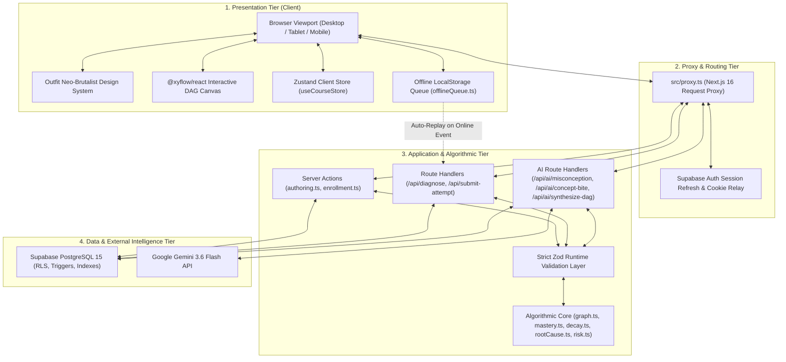
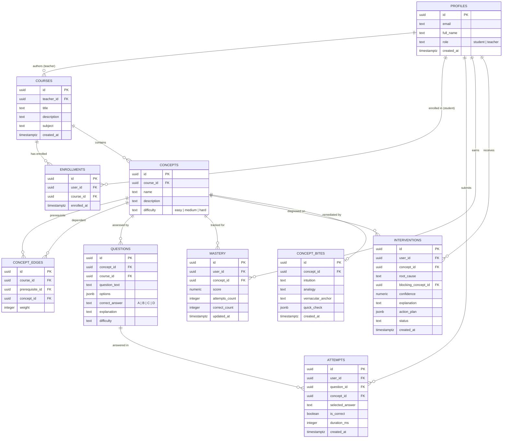

# Technical Requirements Document (TRD)

## Project: LearnPulse
**Autonomous Learning Continuity, Remediation & Cognitive Misconception Engine**  
*SIH 2026 Problem Statement:* **SIH 26207**  
*Document Version:* `1.0.0`  
*Target Release:* `Production Deployment (v1.0)`  
*Document Status:* **Approved**  
*Target Audience:* Software Engineers, System Architects, DevOps, QA Engineers, Security Auditors  

---

## 1. Executive Technical Overview

### 1.1 Architectural Thesis
Traditional Computer-Based Testing (CBT) systems evaluate student performance through flat percentage calculations and generic static explanations. When a student chooses an incorrect answer, these platforms present textbook justifications for why the correct option is right, ignoring the student's internal cognitive heuristic. Furthermore, they evaluate gaps in isolation rather than tracing hierarchical dependencies within the knowledge domain.

**LearnPulse** is architected to solve these fundamental flaws via three coupled technical pillars:
1. **Graph-Native Dependency Traversal:** High-performance, directed acyclic graph (DAG) algorithms (BFS backtracking, Kahn's topological sort, cycle rejection) execute deterministic root-cause analysis in under 5 milliseconds.
2. **Cognitive Distractor Reverse-Engineering ("Mental Mirror"):** An AI inference layer powered by Google Gemini 3.6 Flash that deconstructs the student's flawed mental model, exposes the misconception via cognitive dissonance paradoxes, and provides bilingual 10-second mental anchors (English + Hindi/Hinglish).
3. **Question-Bank-Aware Scaled Mastery & Spaced Retention:** Non-linear mathematical scoring combining bank coverage and exponential decay (Ebbinghaus curve) with forward-dependent application reviews to guarantee permanent retention without rote MCQ grinding.

### 1.2 Core System Attributes & Metrics
* **Prerequisite Traversal Latency:** $< 5\text{ms}$ on graphs up to 2,000 nodes.
* **Misconception Diagnosis Latency:** $< 1\text{ms}$ on in-memory cache hit; $< 1.5\text{s}$ on fresh Gemini 3.6 Flash synthesis.
* **Test Suite Quality:** 100% pass rate across 105 automated unit and algorithmic test assertions in 12 suites (`vitest.config.mjs`).
* **Security & Input Validation:** 0 known package vulnerabilities (`npm audit`), strict Zod schema validation across all endpoints and dynamic routes preventing raw SQL/`22P02` exceptions, zero internal error leakage, and 100% Row-Level Security (RLS) database isolation.
* **Duplicate Prevention:** Automated multi-pass duplicate course detection engine rejecting identical courses across case, punctuation, word order, acronyms, and fuzzy typos.

---

## 2. High-Level System Architecture

### 2.1 Decoupled Four-Tier Topology



---

## 3. Technology Stack & Specifications

| Dimension | Technology / Package | Version | Justification & Architectural Role |
| :--- | :--- | :--- | :--- |
| **Framework** | Next.js (App Router) | `16.3.4` (Turbopack) | Server Components, Streaming SSR, Next.js Server Actions, Route Handlers, sub-second Turbopack compilation. |
| **Language** | TypeScript | `5.x` (`target: ES2022`) | Strict type checking (`--strict`, no implicit `any`), ECMAScript 2022 runtime features. |
| **UI Library** | React / React-DOM | `19.2.8` | Modern React compiler optimizations, server-client boundary guarantees. |
| **Styling** | Tailwind CSS + Vanilla CSS | `v4.x` | Modern utility framework with custom tokens, light/dark themes, and 6px border radii. |
| **Visual Design** | Outfit Neo-Brutalist | Custom CSS / Tokens | Strict typography hierarchy (Google Font Outfit: weights 300, 400, 500, 600), 1.5px/2px borders, high-contrast badges. |
| **Graph Canvas** | `@xyflow/react` | `^12.11.6` | Hardware-accelerated interactive canvas supporting smooth pan, zoom (0.2x–2.5x), mini-map, and custom node renderers. |
| **State Management**| Zustand | `^5.0.15` | Minimalist, single-purpose client state store (`useCourseStore.ts`) without redundant reducers or boilerplate. |
| **Input Validation** | Zod | `^4.5.4` | Strict runtime schema parsing, type bounds, string length constraints, and UUID format verification. |
| **Database & Auth** | Supabase (PostgreSQL 15) | `@supabase/ssr ^0.12.7` | PostgreSQL relational database with Row-Level Security (RLS), atomic upserts, and secure cookie-based session management. |
| **AI LLM Engine** | Google Gemini 3.6 Flash | `@google/generative-ai` | Low-latency inference, JSON schema structured output, bilingual thought-trap synthesis. |
| **Test Runner** | Vitest | `^5.0.0` (`vitest.config.mjs`) | ESM native test runner, 12 test suites, 105 automated unit and algorithmic test assertions. |

---

## 4. Algorithmic Specifications & Mathematical Formulations

### 4.1 Knowledge Graph Directed Acyclic Graph (DAG) Traversal

#### 4.1.1 Adjacency Representation
The prerequisite knowledge graph is represented as a directed graph $G = (V, E)$, where each vertex $v \in V$ represents a concept, and each directed edge $(u, v) \in E$ with weight $w_{uv} \in [1, 10]$ denotes that concept $u$ is a prerequisite for concept $v$.
* Forward adjacency: $\text{adj}[u] = \{v \mid (u, v) \in E\}$ (Dependents)
* Reverse adjacency: $\text{revAdj}[v] = \{u \mid (u, v) \in E\}$ (Prerequisites)

#### 4.1.2 Breadth-First Prerequisite Backtracking
To isolate all foundational concepts that structurally affect a target failing concept $t$, the system performs a reverse BFS:
$$\text{Ancestors}(t) = \{ u \in V \mid \text{path from } u \text{ to } t \text{ exists in } G \}$$
```typescript
// Complexity: O(|V| + |E|) time, O(|V|) memory
export function bfsPrerequisites(
  targetConceptId: string,
  revAdj: Map<string, Array<{ prerequisiteId: string; weight: number }>>
): Set<string> {
  const visited = new Set<string>();
  const queue: string[] = [targetConceptId];
  while (queue.length > 0) {
    const curr = queue.shift()!;
    for (const edge of revAdj.get(curr) || []) {
      if (!visited.has(edge.prerequisiteId)) {
        visited.add(edge.prerequisiteId);
        queue.push(edge.prerequisiteId);
      }
    }
  }
  return visited;
}
```

#### 4.1.3 Kahn's Algorithm for Topological Sort & Cycle Rejection
When teachers author courses or generate graphs with AI, cyclic dependencies (e.g., $A \to B \to C \to A$) must be rejected. LearnPulse applies Kahn's algorithm:
1. Compute in-degree $\text{inDegree}[v]$ for all $v \in V$.
2. Initialize queue $Q$ with all nodes where $\text{inDegree}[v] = 0$.
3. While $Q$ is not empty:
   - Dequeue $u$, append to sorted list $L$.
   - For each neighbor $v \in \text{adj}[u]$:
     - $\text{inDegree}[v] \leftarrow \text{inDegree}[v] - 1$.
     - If $\text{inDegree}[v] = 0$, push $v$ into $Q$.
4. If $|L| < |V|$, a cycle exists: reject the update and throw a structured validation error.

---

### 4.2 Scaled Mastery & Non-Linear Bank Coverage

#### 4.2.1 The Problem with Naive Percentage Averages
Standard platforms calculate $\text{Score} = \frac{\text{correct}}{\text{attempts}} \times 100$. This creates two failure modes:
* **The Infinite Grind:** A student who answers $3/3$ questions correctly gets stuck with an arbitrary score unless they repeat questions dozens of times.
* **The Memorization Loop:** Students repeat questions until answers are memorized without mastering the underlying skill.

#### 4.2.2 The LearnPulse Bank-Aware Scaled Formula
LearnPulse separates **Question Bank Coverage** from **Attempt Accuracy**:
$$\text{Coverage Ratio} = \min\left(1.0, \frac{|\text{Unique Questions Correct}|}{\max(1, |\text{Total Questions in Bank}|)}\right)$$
$$\text{Accuracy Ratio} = \frac{\text{Total Correct Attempts}}{\max(1, \text{Total Attempts})}$$
$$\text{Base Score} = \text{Coverage Ratio} \times \text{Accuracy Ratio} \times 100$$

**Threshold Rule:**
* If $|\text{Total Questions in Bank}| > 0$ and $|\text{Unique Questions Correct}| \ge |\text{Total Questions in Bank}|$ and $\text{Accuracy Ratio} \ge 0.70$:
$$\text{Mastery Score} = 100.0$$
* Otherwise, the score smoothly tracks the scaled base score rounded to the nearest integer.

#### 4.2.3 Exponential Moving Average (EWMA) for Incremental Updates
When updating scores sequentially:
$$S_{t} = \alpha \cdot \text{Score}_{\text{new}} + (1 - \alpha) \cdot S_{t-1}, \quad \alpha = 0.35$$

---

### 4.3 Multi-Factor Root Cause Candidate Ranking

When a student fails a target concept $T$, ancestor prerequisite concepts are ranked by a multi-factor bottleneck score:
$$\text{Score}(u) = w_{\text{dist}} \cdot \left(1 - \frac{d(u, T)}{d_{\max}}\right) + w_{\text{mst}} \cdot \left(1 - \frac{M(u)}{100}\right) + w_{\text{edge}} \cdot \frac{W(u, T)}{W_{\max}}$$
Where:
* $d(u, T)$ is the shortest path distance from $u$ to $T$.
* $M(u) \in [0, 100]$ is the student's current mastery of concept $u$.
* $W(u, T)$ is the edge weight between $u$ and downstream dependents.
* Default weights: $w_{\text{dist}} = 0.35$, $w_{\text{mst}} = 0.45$, $w_{\text{edge}} = 0.20$.
* The candidate with the highest composite score is selected as the primary blocking concept.

---

### 4.4 Ebbinghaus Forgetting Curve & Forward-Dependent Review Selection

#### 4.4.1 Retention Probability Decay Model
Based on the Ebbinghaus exponential decay law:
$$R(t) = e^{-\frac{t}{S}}$$
Where:
* $t$ is the elapsed time in days since the last practice attempt on the concept.
* $S$ is the retention stability factor determined by historical mastery:
$$S = \max\left(1.0, \frac{M}{20}\right)$$
* A concept is marked **Due for Review** when $R(t) < 0.60$ or when $t \ge 7$ days and $M < 80$.

#### 4.4.2 Forward-Dependent Application Review
Rather than testing the decayed concept in isolation, the review selector algorithm identifies direct forward dependents in the DAG:
$$\text{Dependents}(u) = \{ v \in V \mid (u, v) \in E \}$$
The student is presented with a question from a dependent concept $v$. If they answer correctly, both concept $u$ and concept $v$ demonstrate healthy retention. If they fail, the failure immediately traces back to the decayed prerequisite $u$.

---

## 5. Database Architecture & Row-Level Security (PostgreSQL 15)

### 5.1 Relational Schema Diagram



### 5.2 Key Indexing Strategy
To guarantee sub-millisecond query response times under high concurrency:
* `idx_attempts_user_concept`: `CREATE INDEX ON attempts(user_id, concept_id);`
* `idx_mastery_user_concept`: `CREATE UNIQUE INDEX ON mastery(user_id, concept_id);`
* `idx_enrollments_user_course`: `CREATE UNIQUE INDEX ON enrollments(user_id, course_id);`
* `idx_edges_course`: `CREATE INDEX ON concept_edges(course_id);`
* `idx_questions_concept`: `CREATE INDEX ON questions(concept_id);`

### 5.3 Row-Level Security (RLS) Enforcement
1. **Student Isolation:** Students can only read and insert their own records in `attempts`, `mastery`, and `interventions`:
   ```sql
   CREATE POLICY "Students manage own attempts" 
   ON attempts FOR ALL TO authenticated 
   USING (auth.uid() = user_id) 
   WITH CHECK (auth.uid() = user_id);
   ```
2. **Teacher Course Management:** Only teachers can update, insert, or delete courses, concepts, edges, and questions where `courses.teacher_id = auth.uid()`.
3. **Cohort Anonymization:** Teachers querying class averages receive aggregated scores without direct access to individual student attempt histories outside enrolled courses.

---

## 6. API Route Handlers & Server Actions

### 6.1 `POST /api/diagnose`
Executes automated prerequisite backtracking and AI root-cause diagnosis.

* **Authentication:** Authenticated Student session (verified server-side via Supabase SSR).
* **Validation Schema:**
  ```typescript
  const requestSchema = z.object({
    userId: z.string().uuid().optional(),
    targetConceptId: z.string().uuid(),
    targetConceptName: z.string().trim().min(1).max(200),
    targetMastery: z.number().min(0).max(100),
    prerequisites: z.array(z.object({
      conceptId: z.string().uuid(),
      concept: z.string().trim().min(1).max(200),
      mastery: z.number().min(0).max(100),
      edgeWeight: z.number().min(0).max(10),
    })).max(50),
  });
  ```
* **Response Payload (200 OK):**
  ```json
  {
    "rootCause": "Missing prerequisite foundation in B-Tree Indexing",
    "blockingConceptId": "7d56e01a-821b-4f94-81d3-3568c07e0002",
    "blockingConcept": "B-Tree Indexing",
    "confidence": 0.88,
    "explanation": "Query Optimization relies on cost calculation over B-Tree index scans.",
    "actionPlan": [
      "Review B-Tree search and insertion intuition",
      "Solve 3 practice questions on index seek vs scan"
    ]
  }
  ```
* **Failure Semantics:** 400 for malformed payload; 401 for unauthenticated; 500 with generic message `{"error": "Internal server error"}` while logging stack trace to server stdout.

---

### 6.2 `POST /api/submit-attempt`
Records student quiz answers, recalculates scaled mastery atomically, checks retention decay, and triggers revalidation.

* **Request Schema:**
  ```typescript
  const schema = z.object({
    conceptId: z.string().uuid(),
    questionId: z.string().uuid(),
    selectedKey: z.enum(["A", "B", "C", "D"]),
    durationMs: z.number().int().min(0).max(600000).optional(),
    isReviewQuestion: z.boolean().optional(),
    originConceptId: z.string().uuid().optional(),
  });
  ```
* **Atomicity Rollback Guarantee:**
  If the mastery upsert fails after inserting the attempt record, the route performs an atomic rollback:
  ```typescript
  try {
    await supabase.from("mastery").upsert({ ... });
  } catch (upsertErr) {
    console.error("[/api/submit-attempt] Atomic rollback triggered:", upsertErr);
    await supabase.from("attempts").delete().eq("id", insertedAttempt.id);
    return NextResponse.json(
      { error: "Failed to record quiz attempt. Please try again." },
      { status: 500 }
    );
  }
  ```

---

### 6.3 `POST /api/ai/misconception`
Reverse-engineers the student's distractor choice into an actionable cognitive explanation.

* **In-Memory Sub-Millisecond Cache:**
  Cache key: `${questionId}_${selectedKey}_${reasoningSlug}`. If cache matches, returns in $< 1\text{ms}$ with `cached: true`.
* **Fallback Guarantee:**
  If Google Gemini API is rate-limited or fails, returns a deterministic bilingual cognitive paradox structure immediately without throwing 500 errors to the client.

---

### 6.4 `POST /api/ai/synthesize-dag`
Transforms raw syllabus text into structured concepts, validated edges, and diagnostic questions.

* **ACID Course Creation & Duplicate Defense:**
  1. Executes duplicate course detection (`findDuplicateCourse`) against existing teacher courses; rejects duplicates with 409 Conflict.
  2. Inserts course record.
  3. Synthesizes concepts and performs Kahn's topological sort.
  4. Inserts concepts. If concept insertion fails, deletes the newly created orphan course.
  5. Inserts valid prerequisite edges and real-world scenario questions.

---

### 6.5 Server Actions (`src/app/actions/`)
* **`authoring.ts`:**
  - Strict input validation: Every action validates `courseId`, `conceptId`, and `edgeId` upfront via `uuidSchema.safeParse` before querying Postgres.
  - `createCourseAction(formData)`: Teacher-only; verifies authenticated profile role, validates title/subject bounds, and blocks duplicate course titles.
  - `addConceptAction(courseId, data)`: Adds concept node linked to course.
  - `addEdgeAction(courseId, data)`: Evaluates Kahn's topological sort before inserting; rejects cycles with user-friendly error.
  - `deleteCourseAction(courseId)`: Verifies teacher ownership before cascade deletion.
* **`enrollment.ts`:**
  - `enrollInCourseAction(courseId)`: Student-only; validates UUID, writes composite enrollment record, and synchronizes user session metadata.
  - `unenrollFromCourseAction(courseId)`: Drops enrollment and revalidates `/dashboard` and `/dashboard/courses`.

---

## 7. Offline Resilience & Synchronizer (`offlineQueue.ts`)

For rural learning environments or intermittent university WiFi:
1. **Network Detection:** Monitored via `navigator.onLine` and `window.addEventListener("online")`.
2. **Client Persistence:** When offline, quiz attempts are saved to `localStorage` under key `learnpulse_offline_attempts_queue` with unique temporary UUIDs and timestamps.
3. **Sequential Replay:** When connectivity resumes, the client sequentially replays attempts to `/api/submit-attempt` with a 200ms debounce to prevent database race conditions and preserve correct score updates.

---

## 8. Frontend Architecture & Design System

### 8.1 "Outfit Neo-Brutalist" Visual Token System
* **Typography:** Enforced Google Font **Outfit** across all headings, body text, inputs, buttons, and badges:
  - Body & Subtitles: `font-normal` (400) / `font-light` (300)
  - Navigation & Interactive Elements: `font-medium` (500)
  - Headings & Primary Metrics: `font-semibold` (600)
* **Geometry:** 6px radius (`rounded-md`), 1.5px/2px solid borders (`border-2 border-border`).
* **Depth & Elevation:** Hard-offset box shadows:
  - Standard Card: `shadow-[2px_2px_0px_var(--shadow-color)]`
  - Hover Action: `hover:shadow-[3px_3px_0px_var(--shadow-color)]`
* **Accessibility:** Minimum touch target sizes of 44px (`min-h-11`, `min-w-11`) for mobile devices.

### 8.2 Responsive Navigation Topology
* **Desktop ($1024\text{px}+$):** Persistent 288px fixed sidebar (`Sidebar.tsx`) with route badges, live course switcher, and user avatar.
* **Tablet / Mobile ($< 1024\text{px}$):** Sticky top bar (64px) with animated hamburger drawer powered by Framer Motion and touch-optimized dismiss handlers.

---

## 9. Security, Privacy & Compliance Architecture

1. **Zero Information Leakage:** Database constraint codes, SQL exceptions, and internal server paths are caught and logged server-side via `console.error`. The client only ever receives sanitized, human-readable strings.
2. **Secret Hygiene:** 
   - No API keys or secret tokens are bundled into client code.
   - Verified via automated regex scanning: 0 leaks of `AIzaSy...`, `sbp_...`, or service role keys.
   - `.gitignore` strictly isolates `.env*` files.
3. **Dependency Vulnerability Baseline:** Maintained at **0 vulnerabilities** (`npm audit`).
4. **NEP 2020 Compliance:** Vernacular language anchors (Hindi/Hinglish) embedded directly into AI diagnosis prompts to support equitable comprehension.
5. **Input Validation & Query Defense:** All route handlers, server actions, and dynamic route parameters enforce strict Zod schemas (UUID format, bounded character counts). Malformed inputs trigger early 400 Bad Request or `notFound()`, completely preventing Postgres syntax errors (`22P02`) and invalid query executions.

---

## 10. Verification, Testing & Quality Assurance Plan

### 10.1 Automated Test Suites (105 Tests Passing)

```bash
npm run test:run
```

| Suite Path | Focus Area | Test Count | Status |
| :--- | :--- | :---: | :---: |
| `src/lib/algorithms/__tests__/graph.test.ts` | Adjacency, BFS Backtracking, Kahn's Cycle Rejection | 15 | **PASS** |
| `src/lib/algorithms/__tests__/mastery.test.ts` | Scaled Bank Coverage, Threshold Scoring, Accuracy | 15 | **PASS** |
| `src/lib/algorithms/__tests__/risk.test.ts` | Inactivity Scoring, Composite Risk Index | 15 | **PASS** |
| `src/lib/algorithms/__tests__/decay.test.ts` | Ebbinghaus Curve, Half-Life Decay Calculations | 11 | **PASS** |
| `src/lib/algorithms/__tests__/rootCause.test.ts` | Multi-Factor Bottleneck Scoring & Ranking | 9 | **PASS** |
| `src/lib/__tests__/masteryLevels.test.ts` | Tier Classification (Mastered, Developing, At-Risk) | 9 | **PASS** |
| `src/lib/ai/__tests__/dagSynthesis.test.ts` | AI Syllabus Extraction, Edge Generation, Fallbacks | 7 | **PASS** |
| `src/lib/ai/__tests__/conceptBite.test.ts` | Bilingual Recovery Bite Synthesis & Challenge Pools | 5 | **PASS** |
| `src/lib/ai/__tests__/misconception.test.ts` | Thought Trap Reverse-Engineering & Paradox Schema | 5 | **PASS** |
| `src/lib/algorithms/__tests__/reviewSelection.test.ts` | Forward-Dependent Question Selection | 5 | **PASS** |
| `src/lib/offline/__tests__/offlineQueue.test.ts` | LocalStorage Queueing, Dequeuing, and Deduplication | 5 | **PASS** |
| `src/lib/__tests__/enrollment.test.ts` | Course Discovery, Enrollment, and Metadata Sync | 4 | **PASS** |
| **Total** | **Comprehensive Fullstack Verification** | **105** | **100% PASS** |

### 10.2 Quality Check Gate Commands
* **TypeScript Compilation:** `npx tsc --noEmit` (0 errors)
* **Production Build:** `npm run build` (Next.js 16 Turbopack)
* **Database Reset / Seed:** `npm run seed` (`node --env-file=.env.local scripts/reset_demo_data.mjs`)
