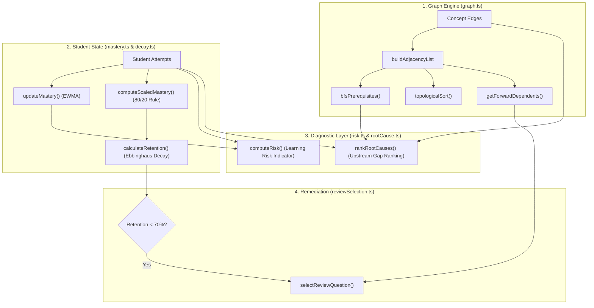
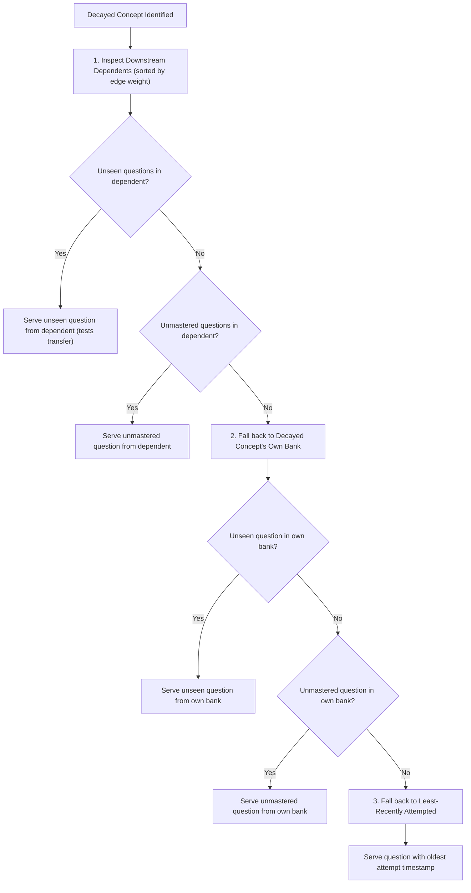

# LearnPulse Algorithmic Engine (`src/lib/algorithms`)

This directory houses the foundational mathematical and graph-theoretical algorithms driving **LearnPulse** — an autonomous learning continuity and cognitive remediation platform.

---

## 1. Engine Overview & Data Flow

The algorithms work together in a closed-loop pedagogical feedback cycle:



---

## 2. Module Specifications

### 2.1 Graph & Topology Engine (`graph.ts`)
* **File:** [`src/lib/algorithms/graph.ts`](file:///e:/learnpulse-app/src/lib/algorithms/graph.ts)
* **Purpose:** Represents the curriculum as a Directed Acyclic Graph (DAG) where nodes are atomic concepts and directed edges indicate prerequisite relationships.

#### Core Interfaces
```typescript
export interface ConceptEdge {
  prerequisite_id: string; // Upstream concept required
  concept_id: string;      // Target concept
  weight: number;          // Prerequisite necessity strength (1 to 5)
}

export interface AdjacencyList {
  prerequisites: Map<string, Array<{ id: string; weight: number }>>;
  dependents: Map<string, Array<{ id: string; weight: number }>>;
}
```

#### Functions & Algorithms
1. **`buildAdjacencyList(edges: ConceptEdge[]): AdjacencyList`**
   * Constructs bidirectional adjacency maps in `O(E)` time and space.
   * `prerequisites.get(concept_id)` returns all upstream concepts required to understand `concept_id`.
   * `dependents.get(prerequisite_id)` returns all downstream concepts unlocked by `prerequisite_id`.

2. **`bfsPrerequisites(targetConceptId: string, adj: AdjacencyList): PrerequisiteNode[]`**
   * Traverses upstream using Breadth-First Search (BFS) to identify all direct and indirect transitive dependencies.
   * Tracks traversal `depth` (hop distance from target) and avoids cycles via a `visited: Set<string>`.
   * **Time Complexity:** `O(V + E)`
   * **Space Complexity:** `O(V)`

3. **`topologicalSort(conceptIds: string[], adj: AdjacencyList): string[] | null`**
   * Employs **Kahn's Algorithm** (in-degree reduction) to compute a valid linear instructional sequence.
   * Identifies circular dependencies (pedagogical deadlock): if `sorted.length !== conceptIds.length`, returns `null`.
   * **Time Complexity:** `O(V + E)`
   * **Space Complexity:** `O(V)`

4. **`getForwardDependents(adj: AdjacencyList, conceptId: string): ConceptEdge[]`**
   * Finds immediate downstream concepts and sorts them in descending order by `edge.weight` (`O(D log D)`).

---

### 2.2 Mastery Calculation (`mastery.ts`)
* **File:** [`src/lib/algorithms/mastery.ts`](file:///e:/learnpulse-app/src/lib/algorithms/mastery.ts)
* **Purpose:** Evaluates concept competency without susceptibility to repetitive guessing or single-question grinding.

#### Mathematical Models

#### A. Exponentially Weighted Moving Average (EWMA)
Evaluates dynamic mastery after each consecutive attempt:

```text
NewScore = α · CorrectValue + (1 - α) · PreviousScore
```

* `α = 0.2` (Smoothing factor: balances immediate response with historical track record)
* `CorrectValue`:
  * If Correct: `100 · DifficultyMultiplier`
  * If Incorrect: `0`
* Difficulty Multipliers:
  * `easy`: `0.8`
  * `medium`: `1.0`
  * `hard`: `1.2`
* Clamped between `0` and `100`.

#### B. Coverage-Weighted Scaled Mastery
Used on course and student dashboard summaries to prevent gaming the system:

```text
Coverage = min(1, max(0, UniqueQuestionsCorrect / TotalConceptQuestions))
Accuracy = min(1, max(0, TotalCorrect / TotalAttempts))

ScaledMastery = round( 80 · Coverage + 20 · (Coverage · Accuracy) )
```

* **The 80/20 Rule:** 80% of points require answering distinct questions in the concept bank. 20% acts as a precision multiplier based on attempt efficiency.

---

### 2.3 Forgetting Curve & Spaced Repetition (`decay.ts`)
* **File:** [`src/lib/algorithms/decay.ts`](file:///e:/learnpulse-app/src/lib/algorithms/decay.ts)
* **Purpose:** Models temporal memory decay based on Hermann Ebbinghaus's forgetting curve.

#### Mathematical Model
```text
R(t) = M · exp( -t / S )
```

* `R(t)`: Retained mastery score at time `t`
* `M`: Baseline mastery score `[0, 100]`
* `t`: Elapsed time in days: `(now - lastAttemptTime) / (1000 · 60 · 60 · 24)`
* `S`: Memory stability factor:
  ```text
  Stability S = BaseStability + (timesCorrect · StabilityGainPerRep)
              = 4 + (3 · timesCorrect)
  ```
* **Due Threshold:** Concepts with `retentionScore < 70` trigger `isDue = true`, initiating automatic spaced review.

---

### 2.4 Learning Risk Indicator (`risk.ts`)
* **File:** [`src/lib/algorithms/risk.ts`](file:///e:/learnpulse-app/src/lib/algorithms/risk.ts)
* **Purpose:** Proactively identifies students requiring pedagogical intervention before outright failure occurs.

#### Multi-Factor Formulation
```text
RiskScore = 0.40 · Weakness + 0.25 · Decline + 0.20 · RepeatedErrors + 0.15 · Inactivity
```

| Parameter | Weight | Description | Normalization |
| :--- | :---: | :--- | :--- |
| **Weakness** | **40%** | Inverted mastery score | `1 - (masteryScore / 100)` |
| **Decline** | **25%** | Performance drop over recent attempts | `(Avg(older 3) - Avg(recent 3)) / 100` |
| **Repeated Errors** | **20%** | Persistence of identical misconceptions | Clamped `[0, 1]` |
| **Inactivity** | **15%** | Days elapsed without practice | `min(days / 30, 1)` |

#### Risk Status Categorization
* `[0.00, 0.30)` ⟶ **Healthy** (Normal progression)
* `[0.30, 0.50)` ⟶ **Monitor** (Early signs of friction)
* `[0.50, 0.70)` ⟶ **At Risk** (Intervention recommended)
* `[0.70, 1.00]` ⟶ **Critical** (Immediate remediation required)

---

### 2.5 Root-Cause Diagnosis Engine (`rootCause.ts`)
* **File:** [`src/lib/algorithms/rootCause.ts`](file:///e:/learnpulse-app/src/lib/algorithms/rootCause.ts)
* **Purpose:** When a learner struggles on an advanced concept, this algorithm evaluates all upstream prerequisite nodes discovered by `bfsPrerequisites()` and ranks them to isolate the fundamental misunderstanding.

#### Ranking Formulation
```text
RootCauseScore = 0.45 · Weakness 
               + 0.25 · (EdgeWeight / 5) 
               + 0.20 · min(FailedAttempts / 20, 1) 
               + 0.10 · Recency
```

* **Weakness (45%):** Prerequisite mastery deficit (`1 - (Mastery / 100)`).
* **Edge Weight (25%):** Structural dependency criticality (normalized against max weight 5).
* **Failure Evidence (20%):** Historical count of failed attempts on the prerequisite (capped at 20).
* **Recency (10%):** How recently the student interacted with the prerequisite.

`rankRootCauses(candidates)` returns the **Top 3** highest-scoring candidates for targeted remediation.

---

### 2.6 Adaptive Review Question Selection (`reviewSelection.ts`)
* **File:** [`src/lib/algorithms/reviewSelection.ts`](file:///e:/learnpulse-app/src/lib/algorithms/reviewSelection.ts)
* **Purpose:** Automatically selects the optimal review item for decayed concepts using a 3-tier fallback strategy.

#### Selection Strategy


---

## 3. Algorithmic Complexity & Characteristics

| Module | Primary Algorithm | Time Complexity | Space Complexity | Deterministic? |
| :--- | :--- | :---: | :---: | :---: |
| `graph.ts` | Kahn's Algorithm (Topological Sort) | `O(V + E)` | `O(V + E)` | Yes |
| `graph.ts` | Breadth-First Search (Prerequisites) | `O(V + E)` | `O(V)` | Yes |
| `mastery.ts` | EWMA Smoothing | `O(N)` attempts | `O(1)` | Yes |
| `mastery.ts` | Scaled Coverage Scoring | `O(1)` | `O(1)` | Yes |
| `decay.ts` | Exponential Forgetting Curve | `O(1)` | `O(1)` | Yes |
| `risk.ts` | 4-Factor Weighted Composite | `O(H)` history | `O(1)` | Yes |
| `rootCause.ts` | Multi-Factor Upstream Scoring | `O(K log K)` | `O(K)` | Yes |
| `reviewSelection.ts` | Tiered Candidate Filtering | `O(D · Q)` | `O(Q)` | Yes |

---

## 4. Testing & Verification

Type checking and linting pass with zero errors:

```bash
npx tsc --noEmit
npm run lint
```
